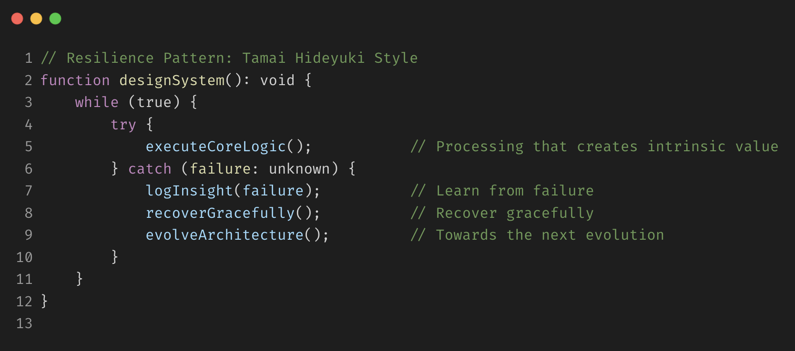

<!-- Typing Banner -->

  

  

---

<h2 align="center">📈 Contribution Graph</h2>

  

---

<h2 align="center">最近の開発</h2>

| リポジトリ名 | 説明 |
|--------------|------|
| [brain-cabinet](https://github.com/tamai-hideyuki/brain-cabinet.git) | 思考や判断のノートを自然言語処理で解析し、内容の意味や関係性をクラスタリングして「自分の思考傾向・成長パターン」を可視化するシステム。いわば、思考ログを活用して自分の意思決定を支援する“外部脳”のようなもの |
| [local-code-ai](https://github.com/tamai-hideyuki/local-code-ai.git) | ローカル環境で完結するAIコーディングアシスタントです。Ollamaと連携し、ファイルの読み書き、コード検索、シェル実行を自然言語で操作できます。「ローカルのみでどこまでできるか」を挑戦したもの |

---

<h2 align="center">🧰 技術スタックバッジ</h2>

  <!-- 🐍 バックエンド -->
  
  
  
  
  

  <!-- 🎨 フロントエンド -->
  
  
  
  
  
  

  <!-- 🖥️ スクリプト -->
  
  

  <!-- 🧱 フレームワーク -->
  
  
  
  

  <!-- 🛠️ インフラ・自動化 -->
  
  
  
  
  
  
  

  <!-- 📱 PWA・オフライン -->
  
  
  

  <!-- ⚖️ 法・RAG・解析 -->
  
  
  
  
  
  

  <!-- 🖥️ コア技術 -->
  
  
  

  <!-- 📚 その他 -->
  
  
  
  
  
  

---
#### [English ☞](./docs/README.en.md)

<h2 align="center">🌱 目指す開発エンジニア像</h2>
私は、プロダクト開発を通じて、課題を発見し、技術をもってその解決に取り組むエンジニアを志しています。

エンジニアリングとは、単なる技術の適用ではなく、本質的な課題と向き合い、より良い在り方を問い続ける営みだと捉えています。
その中で私は、日々の開発を通じて「なぜこの仕様なのか」「何が最も価値に結びつくのか」を自ら考え、手を動かしながら、よりよい選択肢を模索し続ける姿勢を大切にしています。

技術的な関心も多岐にわたりますが、特定の分野にこだわるのではなく、プロダクトの価値を高めるために必要な知識やスキルを柔軟に吸収し、成長し続けることを信条としています。

また、開発は一人では成し得ません。心理的安全性や情報の透明性を意識し、変化を歓迎する姿勢で、チームとして成果を出すことにも力を注ぎたいと考えています。

将来的には、設計・実装だけでなく、プロダクト全体の品質や成長に関わる意思決定にも貢献できるよう、エンジニアとしての視座と影響範囲を広げていくことを目指しています。

---

<h2 align="center">✅ Tamai Hideyuki — Repository Snapshot</h2>

## 🔐 認証・認可（Authentication / Authorization）

| リポジトリ名 | 説明 |
|--------------|------|
| [two-factor-auth](https://github.com/tamai-hideyuki/two-factor-auth.git) | LaravelでGoogle Authenticatorと連携した2段階認証（2FA）を実装したプロジェクト |

---
## 🛠 CLI & Automation

| リポジトリ名 | 説明 |
|--------------|------|
| [devsetup](https://github.com/tamai-hideyuki/devsetup.git) | Dockerベースの**ノーコード開発起点自動生成ツール**。Laravel+Breeze+Google OAuth対応の認証基盤を対話CLIで即座に構築。Symfonyモジュールも搭載し、インフラ構築から認証設計までをローコードで完結。**「属人化ゼロ」ではなく、「構築そのものの省略」を目指す**開発支援ツール。 |
| [git-rename](https://github.com/tamai-hideyuki/git-rename.git) | 複数プロジェクトの Git リモートURL を一括更新する Bash製ユーティリティ。dry-run対応、再帰処理でフォルダを自動スキャンし差分を明示。 |

---

## 📊 スクリプト & 分析

| リポジトリ名                                                                 | 説明                                                                                                                                                                  |
|------------------------------------------------------------------------|---------------------------------------------------------------------------------------------------------------------------------------------------------------------|
| [TrendSeer](https://github.com/tamai-hideyuki/TrendSeer.git)           | TradingView 向け Pineスクリプト。テクニカル分析ロジックを実装                                                                                                                             |
| [cam-motion](https://github.com/tamai-hideyuki/cam-motion.git)                                                         | Pythonベースのリアルタイムモーショントラッキング／CLIツール。OpenCV＋Mediapipeで手足検出、Makefile／スクリプトにより3秒でセットアップ                                                                                 |
| [hourei-api-server](https://github.com/tamai-hideyuki/hourei-api-server.git) | (EC2デプロイ中) Laravel 10.x + Dockerで構築したe-Gov法令APIの中継サーバー。法令名一覧・条文内容・更新法令など、4種のAPIをラップし、Content-Type: XML形式で外部クライアントに提供可能。セミコロン構文など特殊仕様にも対応。動作確認APIも搭載し、API基盤として即利用可能。 |
| [shihou-no-tomo](https://github.com/tamai-hideyuki/shihou-no-tomo.git) | e-Gov法令XML APIから日本法令を取得・整形・検索し、軽量LLM（Mistral GGUF）で自然言語応答可能な司法特化エージェントを構築。Metal対応MacBookでも動作する超軽量RAG構成。（現在構築中）                                                      |
---

## 📚 LT資料

| リポジトリ名 | 説明 |
|--------------|------|
| [lt-ddd](https://github.com/tamai-hideyuki/lt-ddd.git) | DDD再入門スライド。個人開発にDDDを取り入れた実践例 |
| [lt-oauth-reintro](https://github.com/tamai-hideyuki/lt-oauth-reintro.git) | Symfony×OAuthの再入門資料（スライド＋コード＋図解） |

---

## 🌐 Web & PWA

| リポジトリ名                                                             | 説明                                                                                                           |
|--------------------------------------------------------------------|--------------------------------------------------------------------------------------------------------------|
| [main](https://github.com/tamai-hideyuki/main.git)                 | オフライン⇔オンライン自動切替・IndexedDB連携のPWA実験環境                                                              |
| [qr-generator](https://github.com/tamai-hideyuki/qr-generator.git) | 任意のURLからQRコードを生成し、ダウンロード可能にするWeb+PWAアプリ                                                       |
| [php-chatgpt](https://github.com/tamai-hideyuki/chat-php-gpt.git)  | 純粋 PHP のみで動作する「ChatGPT風チャットボット」。セッション管理＋ファイルログで会話を永続化し、“考え中…”演出やキーワード抽出による文脈参照などの工夫を凝らした Web アプリ |
| [recrui-track](https://github.com/tamai-hideyuki/recrui-track.git)                                                   |転職活動を可視化・管理する自己管理PWAツール。現在は最小構成として「ToDoリスト機能」のみを実装し、Next.js + Hono + Drizzle + Supabase による構成で運用。DDD（ドメイン駆動設計）とクリーンアーキテクチャをベースに、今後は企業・面接管理やSlack連携、AI分析機能の拡張を予定。|

---

## 🎮 ゲーム & アルゴリズム

| リポジトリ名 | 説明 |
|--------------|------|
| [sudoku-generator](https://github.com/tamai-hideyuki/sudoku-generator.git) | 数独を6言語（PHP, JS, Ruby, etc）で自動生成するアルゴリズム実装 |
| [knapsack-project](https://github.com/tamai-hideyuki/knapsack-project.git) | Shellスクリプトによるナップサック問題の実装 |

---

## ⚙️ 学習用 & 設計検証

| リポジトリ名 | 説明                                      |
|--------------|-----------------------------------------|
| [docker-symfony-lite](https://github.com/tamai-hideyuki/docker-symfony-lite.git) | Symfony理解のために構築した最小Docker構成             |
| [ddd-ec-project](https://github.com/tamai-hideyuki/ddd-ec-project.git) | DDD＋クリーンアーキテクチャを適用したECサイトプロトタイプ（現在構築中） |
---

> 本ページは継続的にアップデートされます。

### [📚 資料 ☞](docs/learning-journal.md)

