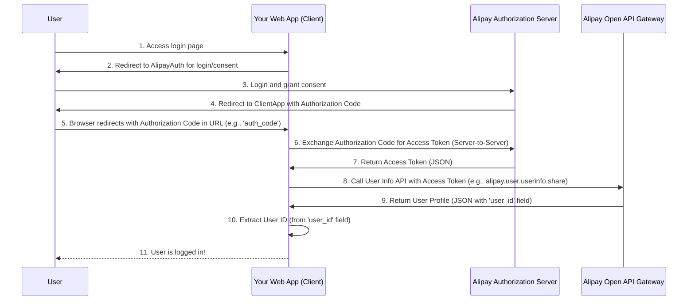
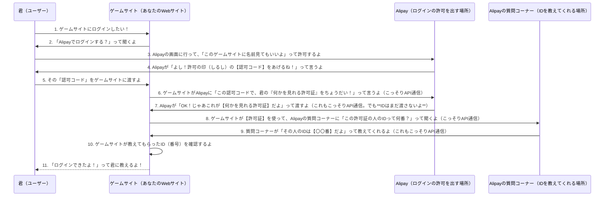

>[Alipay+ Docs: Alipay+のサービス統合に関する主要なドキュメントポータルです。認証や決済フローについて記載されています。](https://docs.alipayplus.com/) 
>[Antom Docs: (Alipay+の親会社であるAnt Groupのドキュメントで、より深い技術情報を含むことがあります)](https://docs.antom.com/)

### 分かりやすく

