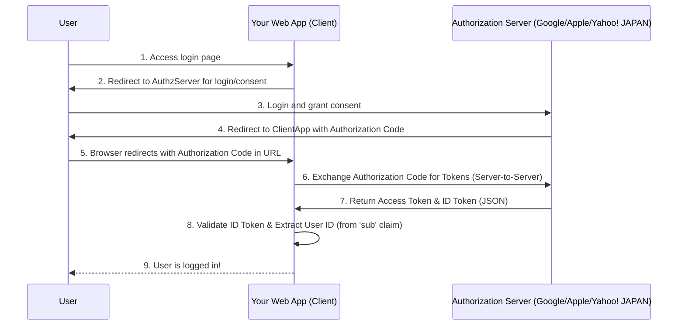
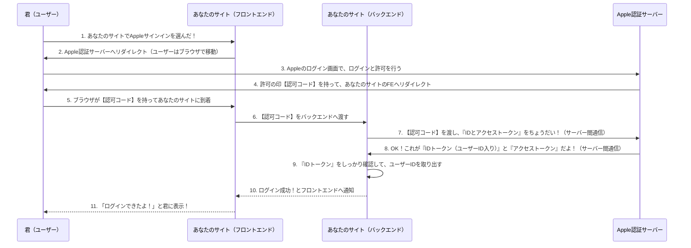

>[Sign in with Apple (開発者向け): Sign in with Appleの実装に関する公式ドキュメントの起点です。](https://developer.apple.com/documentation/authenticationservices/implementing_user_authentication_with_sign_in_with_apple) 
> [REST API ドキュメント: サーバーサイドでの認可コード交換に関する詳細が含まれます。](https://developer.apple.com/documentation/signinwithapplerestapi)

## OpenID Connect (OIDC) に準拠したサービス

### 分かりやすく(web)

