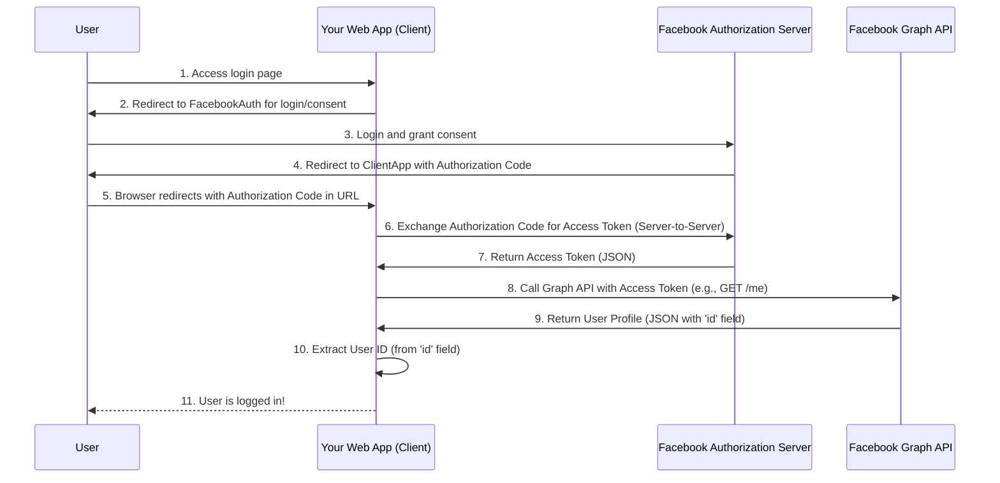
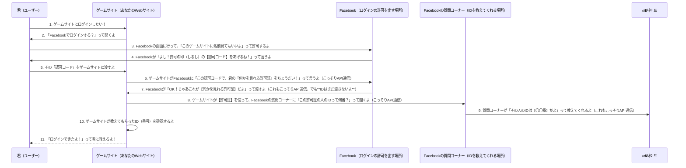

>[Meta for Developers (Facebookログイン): Facebookログインの実装に関する公式ドキュメントの起点です。](https://developers.facebook.com/docs/facebook-login/)

```mermaid
sequenceDiagram
    participant User
    participant ClientApp as Your Web App (Client)
    participant FacebookAuth as Facebook Authorization Server
    participant FacebookGraphAPI as Facebook Graph API
    
    User->>ClientApp: 1. Access login page
    ClientApp->>User: 2. Redirect to FacebookAuth for login/consent
    User->>FacebookAuth: 3. Login and grant consent
    FacebookAuth->>User: 4. Redirect to ClientApp with Authorization Code
    User->>ClientApp: 5. Browser redirects with Authorization Code in URL
    
    ClientApp->>FacebookAuth: 6. Exchange Authorization Code for Access Token (Server-to-Server)
    FacebookAuth->>ClientApp: 7. Return Access Token (JSON)
    
    ClientApp->>FacebookGraphAPI: 8. Call Graph API with Access Token (e.g., GET /me)
    FacebookGraphAPI->>ClientApp: 9. Return User Profile (JSON with 'id' field)
    
    ClientApp->>ClientApp: 10. Extract User ID (from 'id' field)
    ClientApp-->>User: 11. User is logged in!
```

### 分かりやすく

```mermaid
sequenceDiagram
    participant 君 as 君（ユーザー）
    participant ゲームサイト as ゲームサイト（あなたのWebサイト）
    participant Facebook as Facebook（ログインの許可を出す場所）
    participant FacebookAPI as Facebookの質問コーナー（IDを教えてくれる場所）
    
    君->>ゲームサイト: 1. ゲームサイトにログインしたい！
    ゲームサイト->>君: 2. 「Facebookでログインする？」って聞くよ
    君->>Facebook: 3. Facebookの画面に行って、「このゲームサイトに名前見てもいいよ」って許可するよ
    Facebook->>君: 4. Facebookが「よし！許可の印（しるし）の【認可コード】をあげるね！」って言うよ
    君->>ゲームサイト: 5. その「認可コード」をゲームサイトに渡すよ
    
    ゲームサイト->>Facebook: 6. ゲームサイトがFacebookに「この認可コードで、君の『何かを見れる許可証』をちょうだい！」って言うよ（こっそりAPI通信）
    Facebook->>ゲームサイト: 7. Facebookが「OK！じゃあこれが【何かを見れる許可証】だよ」って渡すよ（これもこっそりAPI通信。でも**IDはまだ渡さないよ**）
    
    ゲームサイト->>FacebookAPI: 8. ゲームサイトが【許可証】を使って、Facebookの質問コーナーに「この許可証の人のIDって何番？」って聞くよ（こっそりAPI通信）
    FacebookAPI->>เกม사이트: 9. 質問コーナーが「その人のIDは【〇〇番】だよ」って教えてくれるよ（これもこっそりAPI通信）
    
    ゲームサイト->>ゲームサイト: 10. ゲームサイトが教えてもらったID（番号）を確認するよ
    ゲームサイト-->>君: 11. 「ログインできたよ！」って君に教えるよ！
```

