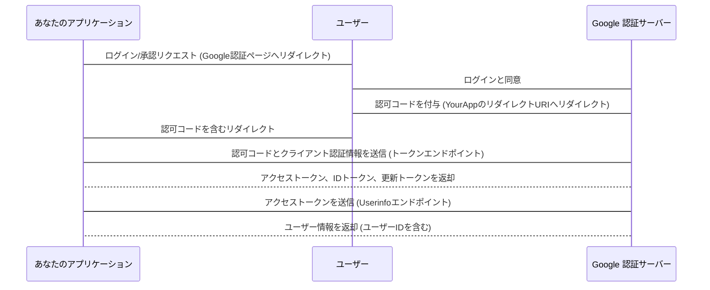

>[Google Identity Platform (開発者向けサイト): OAuth 2.0やOpenID Connectに関するGoogleの包括的なドキュメント](https://developers.google.com/identity) 
>[Web Server Applications向けOAuth 2.0の利用: 認可コードフローの具体的な実装手順が含まれます。](https://developers.google.com/identity/protocols/oauth2/web-server) 

## OpenID Connect (OIDC) に準拠したサービス

認可コードの取得 (既に完了している前提)
このステップは、アクセストークンを取得する前段階で、ユーザーがあなたのアプリケーションにGoogleアカウントへのアクセスを許可するものです。

**エンドポイント:**

- 認可エンドポイント (Authorization Endpoint): https://accounts.google.com/o/oauth2/v2/auth
  - あなたのアプリケーションからGoogleへのリクエスト:
    - HTTP GET リクエスト
    - 主なクエリパラメータ:
        - client_id:あなたのアプリケーションのクライアントID
        - redirect_uri: 認可コードが返されるリダイレクトURI
        - response_type: code (認可コードフローの場合)
        - scope: 取得したい情報のスコープ（例: openid email profile）
        - openid: OpenID Connectを使用することを示す必須スコープ
        - email: ユーザーのメールアドレスを取得
        - profile: ユーザーの基本プロフィール情報（名前、写真など）を取得
        - state: CSRF攻撃を防ぐための任意の文字列
        - Googleからのレスポンス:

- ユーザーがあなたのアプリケーションへのアクセスを許可すると、Googleはredirect_uriに認可コード (code) と state パラメータを付与してリダイレクトします。

**アクセストークン、IDトークン、更新トークンの取得**  

あなたのアプリケーションは、受け取った認可コードを使用して、Googleのトークンエンドポイントからアクセストークン、IDトークン、更新トークンを交換します。

エンドポイント:

トークンエンドポイント (Token Endpoint): https://oauth2.googleapis.com/token
あなたのアプリケーションからGoogleへのリクエスト:

HTTP POST リクエスト
Content-Type: application/x-www-form-urlencoded
ボディパラメータ:
code: ステップ1で取得した認可コード
client_id: あなたのアプリケーションのクライアントID
client_secret: あなたのアプリケーションのクライアントシークレット (ウェブサーバーアプリケーションの場合)
redirect_uri: ステップ1で使用したリダイレクトURIと同じである必要があります
grant_type: authorization_code
Googleからのレスポンス:

JSON形式で以下のデータが返されます。

access_token: Google APIにアクセスするための認証情報。有効期限が短い（通常1時間程度）。
id_token: ユーザーの認証情報を含むJWT (JSON Web Token)。ユーザーID (subクレーム) を含む。
expires_in: アクセストークンの有効期限（秒数）
token_type: Bearer
refresh_token: (初回認証時やオフラインアクセスが許可されている場合) アクセストークンの有効期限が切れた際に新しいアクセストークンを取得するためのトークン。有効期限が長い。
id_token の内容: id_token はJWT形式なので、デコードすることで直接ユーザー情報を取得できます。

sub: (Subject) Googleアカウント全体で一意のユーザーID。これが主要なユーザーIDとなります。
email: ユーザーのメールアドレス
email_verified: メールアドレスがGoogleによって確認済みかどうか (boolean)
name: ユーザーのフルネーム
given_name: ユーザーの名
family_name: ユーザーの姓
picture: ユーザーのプロフィール画像のURL
locale: ユーザーの言語/地域
iss: 発行者 (https://accounts.google.com)
aud: サービス利用者（あなたのアプリケーションのクライアントID）
exp: 有効期限 (Unixタイムスタンプ)
iat: 発行時刻 (Unixタイムスタンプ)
その他、要求されたスコープによっては追加のクレームが含まれる場合があります。
補足: id_token のsubクレームが、あなたのアプリケーションでユーザーを識別するための最も信頼できる一意のIDです。

3. ユーザー情報の取得 (Userinfo エンドポイント)
   id_tokenから基本的なユーザー情報は取得できますが、より詳細な情報や、id_tokenに含まれていない情報を取得したい場合は、userinfoエンドポイントを利用します。これはOpenID Connectの標準の一部です。

エンドポイント:
Userinfo エンドポイント: https://openidconnect.googleapis.com/v1/userinfo
(古いエンドポイント: https://www.googleapis.com/oauth2/v1/userinfo や https://www.googleapis.com/oauth2/v3/userinfo もありますが、OIDCに準拠したhttps://openidconnect.googleapis.com/v1/userinfoの使用が推奨されます)
あなたのアプリケーションからGoogleへのリクエスト:
HTTP GET リクエスト
Authorization ヘッダーにアクセストークンを付与します。
例: Authorization: Bearer YOUR_ACCESS_TOKEN
Googleからのレスポンス:
JSON形式でユーザー情報が返されます。
返されるデータは、トークン取得時に指定したscopeによって異なります。
主なデータ例:
sub: Googleアカウント全体で一意のユーザーID (IDトークンと同じ値)
name: ユーザーのフルネーム
given_name: ユーザーの名
family_name: ユーザーの姓
picture: ユーザーのプロフィール画像のURL
email: ユーザーのメールアドレス
email_verified: メールアドレスが確認済みかどうか
locale: ユーザーの言語/地域
hd: (Hosted Domain) Google Workspace (旧 G Suite) ドメインユーザーの場合、そのドメイン名
profile: プロフィールページのURL (要求されたスコープによる)
まとめ
ユーザーIDの取得:

最も簡潔で推奨される方法は、トークンエンドポイントから返されるid_tokenをデコードし、その中のsubクレームを使用することです。このsubクレームがGoogleアカウント全体で一意のユーザーIDとなります。
より多くのユーザー情報が必要な場合や、id_tokenに含まれない情報が必要な場合は、取得したaccess_tokenを使用してuserinfoエンドポイントを呼び出します。ここでもsubクレームとしてユーザーIDが返されます。
エンドポイント:

認可コード交換用: https://oauth2.googleapis.com/token
ユーザー情報取得用: https://openidconnect.googleapis.com/v1/userinfo
これらの流れとエンドポイントを理解することで、Google認証後のユーザー情報取得を安全かつ効