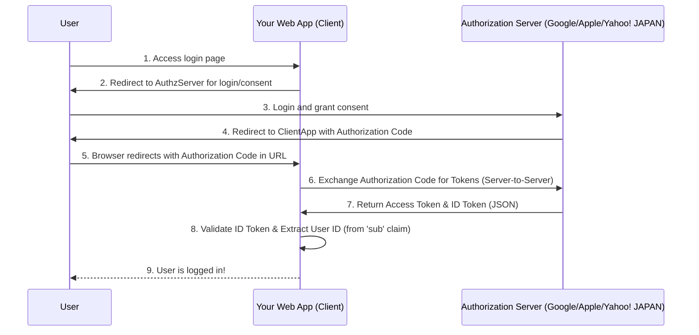
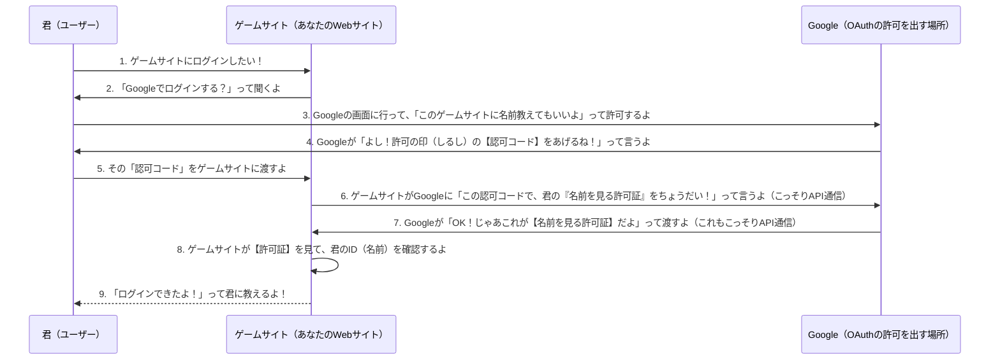
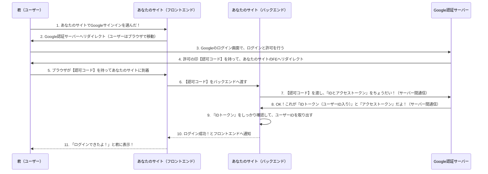

>[Google Identity Platform (開発者向けサイト): OAuth 2.0やOpenID Connectに関するGoogleの包括的なドキュメント](https://developers.google.com/identity) 
>[Web Server Applications向けOAuth 2.0の利用: 認可コードフローの具体的な実装手順が含まれます。](https://developers.google.com/identity/protocols/oauth2/web-server) 

## OpenID Connect (OIDC) に準拠したサービス

```mermaid
sequenceDiagram
    participant User
    participant ClientApp as Your Web App (Client)
    participant AuthzServer as Authorization Server (Google/Apple/Yahoo! JAPAN)
    
    User->>ClientApp: 1. Access login page
    ClientApp->>User: 2. Redirect to AuthzServer for login/consent
    User->>AuthzServer: 3. Login and grant consent
    AuthzServer->>User: 4. Redirect to ClientApp with Authorization Code
    User->>ClientApp: 5. Browser redirects with Authorization Code in URL
    
    ClientApp->>AuthzServer: 6. Exchange Authorization Code for Tokens (Server-to-Server)
    AuthzServer->>ClientApp: 7. Return Access Token & ID Token (JSON)
    
    ClientApp->>ClientApp: 8. Validate ID Token & Extract User ID (from 'sub' claim)
    ClientApp-->>User: 9. User is logged in!
```

### 分かりやすく

```mermaid
sequenceDiagram
    participant 君 as 君（ユーザー）
    participant ゲームサイト as ゲームサイト（あなたのWebサイト）
    participant Google as Google（OAuthの許可を出す場所）
    
    君->>ゲームサイト: 1. ゲームサイトにログインしたい！
    ゲームサイト->>君: 2. 「Googleでログインする？」って聞くよ
    君->>Google: 3. Googleの画面に行って、「このゲームサイトに名前教えてもいいよ」って許可するよ
    Google->>君: 4. Googleが「よし！許可の印（しるし）の【認可コード】をあげるね！」って言うよ
    君->>ゲームサイト: 5. その「認可コード」をゲームサイトに渡すよ
    
    ゲームサイト->>Google: 6. ゲームサイトがGoogleに「この認可コードで、君の『名前を見る許可証』をちょうだい！」って言うよ（こっそりAPI通信）
    Google->>ゲームサイト: 7. Googleが「OK！じゃあこれが【名前を見る許可証】だよ」って渡すよ（これもこっそりAPI通信）
    
    ゲームサイト->>ゲームサイト: 8. ゲームサイトが【許可証】を見て、君のID（名前）を確認するよ
    ゲームサイト-->>君: 9. 「ログインできたよ！」って君に教えるよ！
```

### より詳細に

```mermaid
sequenceDiagram
    participant 君 as 君（ユーザー）
    participant あなたのサイトFE as あなたのサイト（フロントエンド）
    participant あなたのサイトBE as あなたのサイト（バックエンド）
    participant GoogleAuthServer as Google認証サーバー
    
    君->>あなたのサイトFE: 1. あなたのサイトでGoogleサインインを選んだ！
    あなたのサイトFE->>君: 2. Google認証サーバーへリダイレクト（ユーザーはブラウザで移動）
    君->>GoogleAuthServer: 3. Googleのログイン画面で、ログインと許可を行う
    GoogleAuthServer->>君: 4. 許可の印【認可コード】を持って、あなたのサイトのFEへリダイレクト
    君->>あなたのサイトFE: 5. ブラウザが【認可コード】を持ってあなたのサイトに到着
    
    あなたのサイトFE->>あなたのサイトBE: 6. 【認可コード】をバックエンドへ渡す
    あなたのサイトBE->>GoogleAuthServer: 7. 【認可コード】を渡し、『IDとアクセストークン』をちょうだい！（サーバー間通信）
    GoogleAuthServer->>あなたのサイトBE: 8. OK！これが『IDトークン（ユーザーID入り）』と『アクセストークン』だよ！（サーバー間通信）
    
    あなたのサイトBE->>あなたのサイトBE: 9. 『IDトークン』をしっかり確認して、ユーザーIDを取り出す
    あなたのサイトBE-->>あなたのサイトFE: 10. ログイン成功！とフロントエンドへ通知
    あなたのサイトFE-->>君: 11. 「ログインできたよ！」と君に表示！
```