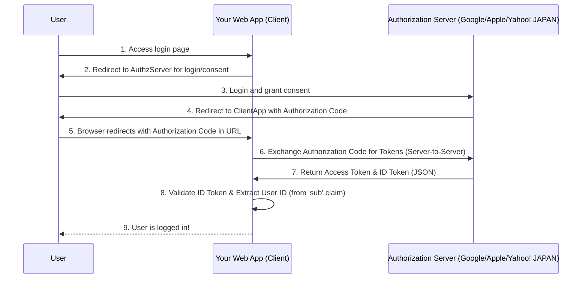
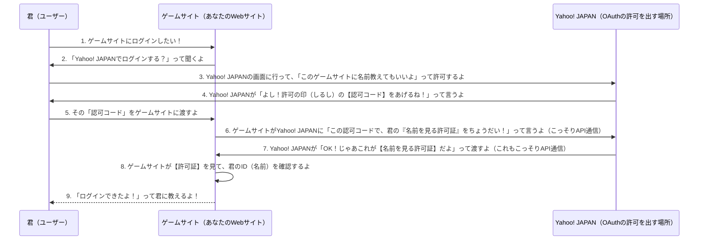

>[Yahoo!デベロッパーネットワーク: Yahoo! JAPAN ID連携に関する全てのドキュメントの起点です。](https://developer.yahoo.co.jp/) 
> [Yahoo! ID連携 v2: 認可コードフローを含むY!Connectの仕様に関する詳細。](https://developer.yahoo.co.jp/yconnect/v2/)

## OpenID Connect (OIDC) に準拠したサービス

### 分かりやすく

