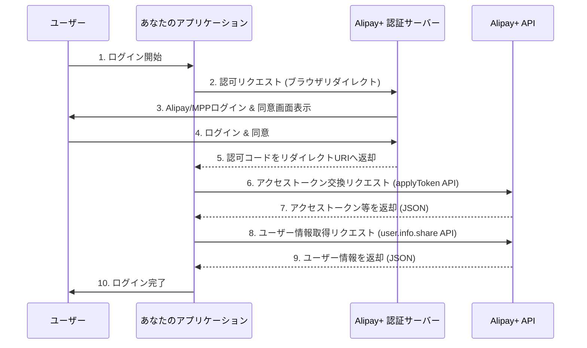

### [ ⏎ 戻る](../index.md)
  

#  Alipay+ OAuth 2.0 認証フロー

**Alipay の OAuth 2.0 認証フローは、主に「Alipay 国際版（Alipay+）」と「中国大陸版 Alipay」でドキュメントが異なります。ここでは、より汎用的な Alipay 国際版 (Alipay+) の認証フローに焦点を当てて説明します。**

**Alipay+ は、様々なモバイル決済アプリ (MPP: Mobile Payment Partners) を統合するサービスのため、通常の OAuth 2.0 フローに加えて、Alipay+ 固有の概念やエンドポイントが含まれることがあります。**

**Alipay+ User Authorization (ユーザー認証) の主要なエンドポイント**
**Alipay+ の認証フローに関する情報は、主に Antom Docs の「User Authorization」セクションで確認できます。**

- **参考ページ ☞**: alipay.intl.oauth.auth.applyToken: [`https://docs.antom.com/ac/userauth/applyToken`](https://docs.antom.com/ac/userauth/applyToken)

---

## 認可エンドポイント (Authorization Endpoint)

**ユーザーが Alipay を通じてあなたのアプリケーションにアクセスを許可するためのエンドポイントです。これは通常、マーチャントがユーザーをリダイレクトする URL です。**

### URL:

**Alipay+ では、具体的な認可エンドポイントの URL は、API を通じて動的に取得するか、特定のシナリオに基づいて構築されることが多いです。例として、以下の形式が示されることがあります。**

- `https://openauth.alipay.com/oauth2/publicAppAuthorize.htm`

**これは中国大陸版 Alipay の例で、国際版では動的に生成される場合が多い**

### 主な必須クエリパラメーター:

- `app_id`: あなたのアプリケーション ID。
- `scope`: 要求するユーザー情報の範囲。
  - 例: auth_user (ユーザーの基本情報を取得する一般的なスコープ)
- `auth_base` (ユーザーIDのみを取得するベーススコープ)
- `auth_payment` (決済関連の権限など、より高度なスコープ)
- `redirect_uri`: 認可コードが返されるリダイレクト URI。Alipay+ Developer Center で登録したものと一致する必要があります。
- `state`: CSRF 対策として必須。リクエストごとに生成するユニークな文字列。

### 正常時のレスポンス:

**ユーザーが認証と許可を完了すると、指定した redirect_uri にリダイレクトされ、URL のクエリパラメーターとして以下の情報が含まれます。**

- `authCode`: 一時的な認可コード。後続のトークン交換に使用します。
- `state`: リクエスト時に送信した state パラメーターと同じ値。
- `app_id`: あなたのアプリケーション ID。
- `scope`: 許可されたスコープ。

---

## アクセストークンエンドポイント (Token Endpoint)

**認可コードをアクセストークンに交換するためのエンドポイントです。**

### URL:

- `https://open.alipay.hk/api/alipay/intl/oauth/auth/applyToken.htm`

**国際版 Alipay+ の applyToken API**  

**注: これは一般的な oauth/token とは異なり、Alipay+ 固有の API エンドポイント名です。**

## 主な必須クエリパラメーター (POST リクエストのボディに含める):

- `grantType`: AUTHORIZATION_CODE (認可コードをアクセストークンと交換する場合) または REFRESH_TOKEN (リフレッシュトークンを使用してアクセストークンを更新する場合)。
- `authCode`: (grantType が AUTHORIZATION_CODE の場合) 認可エンドポイントから取得した認可コード。
- `authMerchantId`: 認証済みマーチャント ID。
- `authSite`: 認証サイト (例: ALIPAY_CN, ALIPAY_HK など)。
- `reqTime`: リクエスト時刻。
- `reqMsgId`: 各リクエストに割り当てられる一意の ID (UUID)。
  

- 重要: Alipay の API は、一般的な OAuth と異なり、リクエストの署名 (sign, signType) や app_id などの公開リクエストパラメーターが必要です。
- これらは API Gateway (`https://openapi.alipay.com/gateway.do`) を介して呼び出す際の共通パラメーターであり、上記の applyToken.htm はそのゲートウェイの背後にあるサービスエンドポイントと考えられます。

### 正常時のレスポンス:
**JSON 形式で以下のデータが返されます。**

- `result`: トークン取得の結果。resultCode が SUCCESS であれば成功。
- `accessToken`: Alipay+ API にアクセスするためのアクセストークン。
- `expiresIn`: アクセストークンの有効期限（秒）。
- `refreshToken`: 新しいアクセストークンを取得するためのリフレッシュトークン。
- `refreshExpiresIn`: リフレッシュトークンの有効期限（秒）。
- `userId`: Alipay アカウント全体で一意のユーザー ID。
- `authUserId`: 認証されたユーザー ID。

---

## ユーザー情報取得 (User Information API)

**アクセストークンを使用してユーザーの情報を取得する API です。**

### URL:

- `https://open.alipay.com/gateway.do`

**これは Alipay の汎用的な API Gateway エンドポイントであり、method パラメーターで呼び出す API を指定します。**

### 主な必須クエリパラメーター (POST リクエストのボディに含める):

- `app_id`: あなたのアプリ ID。
- `method`: alipay.user.info.share (ユーザー情報共有 API のメソッド名)。
- `format`: JSON (または XML)。
- `charset`: UTF-8 など。
- `sign_type`: 署名タイプ (例: RSA2)。
- `sign`: リクエストの署名。
- `auth_token`: アクセストークンエンドポイントで取得した accessToken。

### 正常時のレスポンス:

**JSON 形式でユーザー情報が返されます。**

- `user_id`: Alipay アカウント全体で一意のユーザー ID。
- `avatar`: ユーザーのプロフィール画像 URL。
- `nick_name`: ユーザーのニックネーム。
- `gender`: 性別。
- `province`: 省。
- `city`: 市。
- `is_student_certified`: 学生認証済みかどうか。
- `user_type`: ユーザータイプ (個人、企業など)。
- `user_status`: ユーザーの状態 (有効、無効など)。
- `is_licence_auth`: 実名認証済みかどうか。
- `user_name`: ユーザーの氏名。
- `phone`: 電話番号 (権限と設定による)。

---

重要な注意点:

Alipay の API は、一般的な OAuth 2.0 に加えて、署名 (Signature) の生成と検証が必須です。これは、各リクエストとレスポンスの整合性とセキュリティを保証するために重要です。署名には、RSA2 などの公開鍵暗号方式が用いられ、Alipay Developer Portal で鍵ペアを設定する必要があります。
Alipay のドキュメントは、Alipay+ (グローバル) と中国大陸版で一部異なるAPIが存在する場合があります。使用するサービスの種類に応じて、適切なドキュメントを参照してください。
Alipay 連携は、他の一般的な OAuth プロバイダーと比較して、署名や特定の API 呼び出しパターンに違いがあるため、ドキュメントを丁寧に読み込むことが非常に重要です。

---

# 参考資料まとめ

- alipay.intl.oauth.auth.applyToken: 
  - [`https://docs.antom.com/ac/userauth/applyToken`](https://docs.antom.com/ac/userauth/applyToken)
  

- Antomドキュメントへようこそ
  - [`https://docs.antom.com/`](https://docs.antom.com/)

- ウェブ/モバイルアプリ
  - [`https://open.alipay.com/module/webApp`](https://open.alipay.com/module/webApp)
  

### [ ⏎ 戻る](../index.md)
