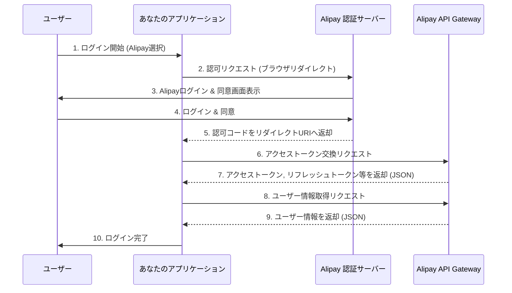
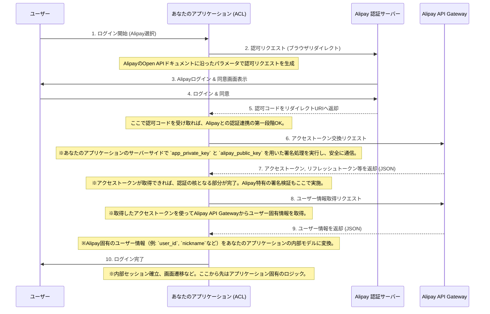

### [ ⏎ 戻る](../index.md)
  
# 中国大陸版AlipayのOAuth 2.0認証フロー

- 中国大陸版 Alipay: 中国国内での決済・生活サービス全般をカバーする「個別の決済アプリ」。
- Alipay+: 国際的な決済エコシステムを構築し、複数の海外決済アプリを一つのプラプラットフォームで加盟店に提供する「決済ソリューション」。

---

## 認可エンドポイント (URL拼接)
**ユーザーにAlipayアカウントへのアクセス許可を求めるためのURLです。**

### URL:

- `https://openauth.alipay.com/oauth2/publicAppAuthorize.htm`

### 主な必須クエリパラメーター:

- `app_id`: アプリケーションID。Alipayオープンプラットフォームでアプリケーションを作成した際に発行されます。
- `scope`: ユーザーがアプリケーションに許可する権限の範囲。
- `auth_base`: ユーザーID (user_id) のみを取得する場合。ユーザーは同意を求められず、自動的にリダイレクトされます（静默授权）。
- `auth_user`: ユーザーの基本情報（アバター、ニックネームなど）を取得する場合。ユーザーは手動で同意を求められます。
- `redirect_uri`: ユーザーが認証後にリダイレクトされるアプリケーションのコールバックURL。URLエンコードが必要です。
- `state`: (オプションですが、推奨) CSRF攻撃を防ぐための一意の文字列。認可サーバーからのリダイレクト時にそのまま返されます。

### 正常時のレスポンス:

**ユーザーが認証に成功すると、redirect_uri にリダイレクトされ、URLのクエリパラメーターとして以下の情報が返されます。**

- `auth_code`: 一時的な認可コード。アクセストークンと交換するために使用します。
- `state`: リクエスト時に指定した state と同じ値。

---

## アクセストークンエンドポイント (alipay.system.oauth.token API)

**取得した auth_code を用いて、access_token (アクセストークン) および refresh_token を取得するAPIです。**

### URL:

- `https://openapi.alipay.com/gateway.do`

### 必須クエリパラメーター (リクエストボディまたはフォームデータとして送信):

**AlipayのAPIは、共通のシステムパラメーターとビジネスパラメーターを組み合わせてリクエストを送信します。**

### 共通システムパラメーター (すべて必須):

- `app_id`: アプリケーションID。
- `method`: APIメソッド名。この場合は alipay.system.oauth.token。
- `format`: レスポンス形式。通常は JSON。
- `charset`: リクエストエンコーディング。例: UTF-8。
- `sign_type`: 署名アルゴリズム。RSA2 (SHA256withRSA) が推奨されます。
- `sign`: リクエストパラメーターの署名文字列。この署名は非常に重要で、Alipay API呼び出しのたびに生成が必要です。
- `timestamp`: リクエスト送信時刻。形式: yyyy-MM-dd HH:mm:ss。
- `version`: APIバージョン。通常は 1.0。

### ビジネスパラメーター (必須):

- `grant_type`: 許可タイプ。authorization_code (認可コードフローの場合) または refresh_token (リフレッシュトークンを使用する場合)。
- `code`: (grant_typeがauthorization_codeの場合に必須) 認可エンドポイントで取得したauth_code。
- `refresh_token`: (grant_typeがrefresh_tokenの場合に必須) アクセストークンをリフレッシュするためのトークン。

### 正常時のレスポンス:
**JSON 形式で以下のデータが返されます。**

- `access_token`: API呼び出しに使用するアクセストークン。
- `expires_in`: access_token の有効期限（秒）。
- `refresh_token`: access_token を更新するためのリフレッシュトークン。
- `re_expires_in`: refresh_token の有効期限（秒）。
- `user_id`: ユーザーのAlipay ID。

---

## ユーザー情報取得エンドポイント (alipay.user.info.share API)
**取得した access_token を用いて、ユーザーの公開プロフィール情報を取得するAPI**

### URL:

- `https://openapi.alipay.com/gateway.do`

### 必須クエリパラメーター (リクエストボディまたはフォームデータとして送信):
### 共通システムパラメーター (すべて必須):

- `app_id`: アプリケーションID。
- `method`: APIメソッド名。この場合は alipay.user.info.share。
- `format`: レスポンス形式。通常は JSON。
- `charset`: リクエストエンコーディング。例: UTF-8。
- `sign_type`: 署名アルゴリズム。RSA2 が推奨されます。
- `sign`: リクエストパラメーターの署名文字列。
- `timestamp`: リクエスト送信時刻。形式: yyyy-MM-dd HH:mm:ss。
- `version`: APIバージョン。通常は 1.0。
- `auth_token`: (ビジネスパラメーターではありませんが、API呼び出しに必須) alipay.system.oauth.token で取得した access_token。

### 正常時のレスポンス:

**JSON 形式でユーザー情報が返されます。**

- `user_id`: ユーザーのAlipay ID。
- `nick_name`: ユーザーのニックネーム。
- `avatar`: ユーザーのアバター画像のURL。
- `province`: ユーザーの居住地の省名。
- `city`: ユーザーの居住地の市名。
- `gender`: ユーザーの性別。

---

**重要事項**:

- 署名 (Signature): 
  - AlipayのAPIは、すべてのリクエストとレスポンスで署名（sign）の生成と検証が必須です。
  - これはセキュリティ上非常に重要な部分であり、実装時にはAlipayが提供するSDKを使用するか、署名アルゴリズム（RSA2）と手順を正確に理解する必要があります。

- キーペアの設定:
  - アプリケーションの秘密鍵と公開鍵、およびAlipayの公開鍵の設定が開発者コンソールで必要です。

- サンドボックス環境: 
  - 開発中はサンドボックス環境でテストすることができます。サンドボックスのURLは本番環境と異なるので、ドキュメントで確認してください。

---
# 破談防止層の視点から

### 破断防止層を導入することで、アプリケーションのコアロジックは外部サービスの具体的な実装詳細から切り離され、保守性や拡張性が向上します。

- 特徴：
  - 標準的なOAuth 2.0の認可コードフローをベースにしていますが、RSA署名によるリクエスト/レスポンスの認証・検証が必須となる点が大きな特徴

- ACLの役割：
  - 認可コードの受け取りとアクセストークン交換をサーバーサイドで行う
  - トークン交換リクエストやその後のAPIリクエストにおいて、アプリケーション秘密鍵 (app_private_key) を用いたRSA署名を生成し、リクエストに含める
  - Alipayからのレスポンスについても、Alipay公開鍵 (alipay_public_key) を用いた署名検証を行い、レスポンスの完全性と信頼性を確認
  - Alipay API Gatewayから返されるユーザー情報（例: user_id, nicknameなど）を、内部システムが利用しやすい形式に変換

- ポイント：
  - 署名と署名検証という、他のプロバイダーにはないセキュリティ要件がACLの中核をなします。
  - この複雑な署名ロジックをACLに閉じ込めることで、アプリケーションの他の部分はAlipay固有のセキュリティ詳細を知る必要がなくなります。

---

## ACLから情報を取得する固有のアクセストークン集約リポジトリアダプターという観点でOAuthエンドポイントと関連情報を整理
**この「アクセストークン集約リポジトリアダプター」は、ACLのバックエンド側コンポーネントとして、内部システムからの要求に応じてAlipayとのOAuthフローを完遂し、必要なトークンやユーザー情報を安全に取得・管理し、抽象化された形で提供する役割を担います。Alipayは署名認証の仕組みが特徴的なため、その点がACLの重要な役割となる。**

---

# 参考資料まとめ

- 支付宝开放平台 (Alipay Open Platform) - 製品紹介 - 会員情報取得 ☞ : [`https://opendocs.alipay.com/open/284/106000`](https://opendocs.alipay.com/open/284/106000)
  - **このページは、会員情報取得機能の概要と、PCウェブページ、モバイルアプリ、H5ページ、ミニプログラムなど、さまざまなシナリオでの認証フローへのリンクを提供しています。**
  

- PC 网页内获取用户信息 (PCウェブページでのユーザー情報取得) ☞ : [`https://opendocs.alipay.com/open/284/web`](https://opendocs.alipay.com/open/284/web)
  - **OAuth 2.0の各ステップと詳細なパラメータについて最も包括的に説明**
