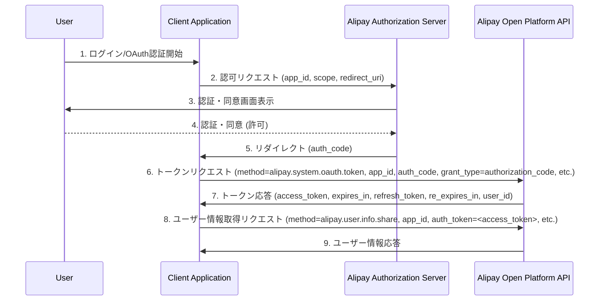

#  Alipay OAuth認証とユーザー情報取得

## OAuth認証フロー

- **AlipayのOAuth認証フローは、Alipay Open Platformを通じて行われ、主に認可コードグラントタイプを使用します。**


```mermaid
sequenceDiagram
    participant User
    participant ClientApp as Client Application
    participant AlipayAuth as Alipay Authorization Server
    participant AlipayAPI as Alipay Open Platform API

    User->>ClientApp: 1. ログイン/OAuth認証開始
    ClientApp->>AlipayAuth: 2. 認可リクエスト (app_id, scope, redirect_uri)
    AlipayAuth->>User: 3. 認証・同意画面表示
    User-->>AlipayAuth: 4. 認証・同意 (許可)
    AlipayAuth->>ClientApp: 5. リダイレクト (auth_code)
    ClientApp->>AlipayAPI: 6. トークンリクエスト (method=alipay.system.oauth.token, app_id, auth_code, grant_type=authorization_code, etc.)
    AlipayAPI->>ClientApp: 7. トークン応答 (access_token, expires_in, refresh_token, re_expires_in, user_id)
    ClientApp->>AlipayAPI: 8. ユーザー情報取得リクエスト (method=alipay.user.info.share, app_id, auth_token=<access_token>, etc.)
    AlipayAPI->>ClientApp: 9. ユーザー情報応答
```

##  エンドポイントと主なクエリパラメータ

- 認可エンドポイント
  - URL: https://openauth.alipay.com/oauth2/publicAppAuthorize.htm
  - HTTPメソッド: GET
  - 主な必須クエリパラメータ:
    - app_id: アプリケーションのApp ID
    - scope: 要求する権限。ユーザー情報取得には通常 auth_user を指定。
    - redirect_uri: 認証後にリダイレクトされるURL。Alipay Open Platformで設定したものと一致する必要があります。
- トークンエンドポイント
  - AlipayのAPI呼び出しは、全て単一のゲートウェイエンドポイント https://openapi.alipay.com/gateway.do を介して行われます。APIメソッドはリクエストパラメータとして指定します。
    - URL: https://openapi.alipay.com/gateway.do
    - HTTPメソッド: POST
    - 主な必須リクエストボディパラメータ（例: alipay.system.oauth.token を呼び出す場合）
      - app_id: アプリケーションのApp ID。
      - method: alipay.system.oauth.token
      - charset: 文字エンコーディング (例: UTF-8)。
      - sign_type: 署名アルゴリズム (例: RSA2)。
      - sign: リクエスト内容の署名。
      - timestamp: リクエストのタイムスタンプ (例: 2024-01-01 12:00:00)。
      - version: APIバージョン (例: 1.0)。
      - auth_code: 認可エンドポイントから取得した認可コード。
      - grant_type: authorization_code (認可コードを交換する場合) または refresh_token (リフレッシュトークンで新しいアクセストークンを取得する場合)。

## レスポンス（正常時）

- **トークン交換の正常応答例 (alipay_system_oauth_token_response):**

```json
{
  "alipay_system_oauth_token_response": {
    "access_token": "authusrB9b418a09f87c47098e9b626e033d45X90",
    "expires_in": 300,
    "refresh_token": "refrB1280d87a55b41229b4e64f1d24c084X90",
    "re_expires_in": 300,
    "user_id": "2088xxxxxxxxx"
  },
  "sign": "ER43KLJ..."
}
```

- access_token: APIリクエストに用いるアクセストークン。
- expires_in: アクセストークンの有効期間（秒）。非常に短く、通常300秒（5分）です。
- refresh_token: 新しいアクセストークンを取得するためのリフレッシュトークン。
- re_expires_in: リフレッシュトークンの有効期間（秒）。アクセストークンと同様に短く、通常300秒（5分）です。
- user_id: Alipayユーザーの一意なID。


## ユーザー情報取得APIエンドポイントと仕様概要

- **access_token を使用してユーザー情報を取得するには、alipay.user.info.share APIを呼び出します。**

- APIエンドポイント
  - API: alipay.user.info.share
  - エンドポイント: https://openapi.alipay.com/gateway.do
  - HTTPメソッド: POST
  - 主な必須リクエストボディパラメータ（例: `alipay.user.info.share` を呼び出す場合）:
    - `app_id`: 
      - あなたのアプリケーションに割り当てられた一意のID。アリペイ開発者プラットフォームでアプリケーションを作成する際に取得できる。このIDは、アリペイがどのアプリケーションからのリクエストであるかを識別するために使用するもの。
    - `method=alipay.user.info.share`: 
      - 呼び出すAPIの具体的なメソッド名を示す。この場合は、ユーザー情報を共有するためのAPIを指定する。リクエストがどの機能に対するものかをアリペイに伝える役割。
    - `charset`: 
      - リクエストデータの文字エンコーディングを指定。通常は UTF-8 が使用。データの破損を防ぎ、正しく情報を処理するために不可欠な設定。
    - `sign_type`: 
      - リクエストの署名に使用する暗号化アルゴリズムのタイプを指定。例えば、RSA2（SHA256withRSA）や RSA（SHA1withRSA）など。選択したタイプに基づいて、リクエストのデジタル署名が生成される。
    - `sign`: 
      - リクエストデータのデジタル署名。これは、app_id、method、charset、timestampなどの他のパラメータと、あなたの秘密鍵を使用して生成される。アリペイはこの署名を検証することで、リクエストが改ざんされていないこと、そして正規のアプリケーションから送信されたものであることを確認している。
    - `timestamp`: 
      - リクエストが送信された日時を示す。形式は yyyy-MM-dd HH:mm:ss。このタイムスタンプは、リプレイ攻撃を防ぎ、リクエストの鮮度を保証するために使用される。
    - `version`: 
      - APIのバージョンを指定。通常は 1.0 が使用されるが、APIの更新に伴い変更されることもある。これによって、アリペイはリクエストを適切なAPIバージョンで処理できる。
    - `auth_token`: 
      - ユーザー情報を取得するために最も重要なパラメータの一つ。
        - `alipay.system.oauth.token API`を呼び出して取得した `access_token` をここに設定します。このトークンは、特定のユーザーがあなたのアプリケーションに対して自身の情報へのアクセスを許可したことを証明するものであり、ユーザーの認証状態を示すために使用される。

## 取得可能なユーザー情報フィールドと必要なスコープ
- **scope=auth_user が必要**

|フィールド名| 	概要                               |
|---|-----------------------------------|
|user_id| 	AlipayユーザーID (一意な識別子)            |
|avatar| 	プロフィール写真のURL                     |
|province| 	省                                |
|city| 	市                                |
|nick_name| 	ニックネーム                           |
|is_student_certified| 	学生認証されているか (ブーリアン)               |
|user_type| 	ユーザータイプ (2は企業アカウント, 1は個人アカウント)   |
|user_status| 	ユーザーのステータス (Tは有効)                |
|is_certified| 	実名認証されているか (ブーリアン)               |
|gender| 	性別 (mは男性, fは女性)                  |


## レスポンス例 (正常時)
```json
{
  "alipay_user_info_share_response": {
    "user_id": "2088xxxxxxxxx",
    "avatar": "http://tfsimg.alipay.com/images/alipay_user_info/xxxx.png",
    "province": "上海",
    "city": "上海",
    "nick_name": "テストユーザー",
    "is_student_certified": "F",
    "user_type": "1",
    "user_status": "T",
    "is_certified": "T",
    "gender": "m",
    "code": "10000",
    "msg": "Success"
  },
  "sign": "DFGHJK..."
}
```

## アクセストークンとリフレッシュトークン

- アクセストークン: 通常300秒（5分）と非常に短命です。セキュリティ上の理由（トークンが盗まれた際のリスク軽減）が背景にあると推測されます。
- リフレッシュトークン: アクセストークンと同様に、通常300秒（5分）と短命です。
- 注意: Alipay+の統合パートナーによっては、基となるモバイル決済パートナー（MPP）の仕様により、アクセストークンの有効期限が1年以上と長い場合もあります。これはAlipayの標準的なOAuthフローとは異なる可能性があります。
- ベストプラクティス: 短命なトークンのため、アプリケーションはリフレッシュトークンを頻繁に利用して新しいアクセストークンを取得し、ユーザーセッションを維持する必要があります。

## エラーハンドリング

- **Alipay Open PlatformのAPIは、共通のエラー構造を返します。**
```json
{
  "code": "エラーコード",
  "msg": "エラーメッセージ",
  "sub_code": "詳細エラーコード",
  "sub_msg": "詳細エラーメッセージ"
}
```
- code: 共通のエラーコード。10000 は成功を示し、それ以外はエラー。
- msg: 共通のエラーメッセージ。
- sub_code: API固有の詳細なエラーコード。
- sub_msg: API固有の詳細なエラーメッセージ。

**例えば、無効なauth_tokenが指定された場合、isv.invalid-auth-tokenのようなsub_codeが返されることがあります。**


---

## [OAuth認証におけるエンドポイント、主なクエリパラメーター、およびレスポンスを確認できる公式ドキュメントへ ☞](https://docs.antom.com/ac/global/oauth_token)
