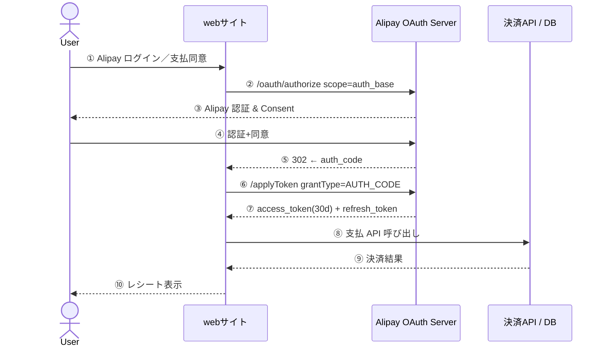

### [ ⏎ 戻る](../index.md)
#  Alipay OAuth認証とユーザー情報取得

## OAuth認証フロー

- **AlipayのOAuth認証フローは、Alipay Open Platformを通じて行われ、主に認可コードグラントタイプを使用します。**


```mermaid
sequenceDiagram
  actor User
  participant Site as webサイト
  participant AAuth as Alipay OAuth Server
  participant PayAPI as 決済API / DB

  User->>Site: ① Alipay ログイン／支払同意
  Site->>AAuth: ② /oauth/authorize scope=auth_base
  AAuth-->>User: ③ Alipay 認証 & Consent
  User->>AAuth: ④ 認証+同意
  AAuth-->>Site: ⑤ 302 ← auth_code
  Site->>AAuth: ⑥ /applyToken grantType=AUTH_CODE
  AAuth-->>Site: ⑦ access_token(30d) + refresh_token
  Site->>PayAPI: ⑧ 支払 API 呼び出し
  PayAPI-->>Site: ⑨ 決済結果
  Site-->>User: ⑩ レシート表示

```
---
### ログインしているユーザーIDを安全に取得するための、最も推奨される、そして最終的に最も確実なステップ

#### [ユーザーID取得方法へ](../allowed-code-flows/alipay_user_id.md)

---

## webサイトからサーバーに向けて打つAPIの回数

- 回数：3 回

## それぞれのAPIのエンドポイントと正常時のレスポンス

## GET https://openauth.alipay.com/oauth2/publicAppAuthorize.htm
### 用途：
- ユーザーを Alipay+ の認可画面にリダイレクトし、認可コード（auth_code）を取得する

### 必要なパラメータ（URLクエリ）

| 要素             | 説明                                                                     |
| -------------- | ---------------------------------------------------------------------- |
| `app_id`       | Alipay で発行されたアプリケーション ID                                               |
| `redirect_uri` | 認可後に `auth_code` を返す自社サイトのコールバック URL（事前登録済み）                           |
| `scope`        | 要求する権限（例：`auth_base`／`auth_user`／`auth_userinfo`／`auth_agreement_pay`） |
| `state`        | CSRF 攻撃を防ぐランダム文字列                                                      |

### 認可エンドポイントからの リダイレクト／POST レスポンス(/oauth2/publicAppAuthorize.htm)
- ステータス：302 Found
- Location ヘッダー：
```text
https://your.site/callback?
  auth_code=AUTH_CODE&
  state=ORIGINAL_STATE
```
- 方式：自動 GET リダイレクト
- 返却パラメータ：
  - auth_code：認可コード
  - state：CSRF 対策

- エラー時：
```text
?error=LOGIN_FAILED&
  error_description=User+cancelled+
  the+login&
  state=...
```
- 注):
  - Alipay はパラメータ署名必須の RPC 呼び出しが続く
  - state で画面遷移の整合性を保証すること


---
## POST https://openapi.alipay.com/gateway.do (method=alipay.system.oauth.token)
### 用途：
- 認可コード（auth_code）を access_token・refresh_token・user_id に交換する

### 必要な要素（POST body, application/x-www-form-urlencoded）

| 要素           | 説明                                             |
| ------------ | ---------------------------------------------- |
| `app_id`     | Alipay アプリケーション ID                             |
| `method`     | `"alipay.system.oauth.token"` ― 呼び出す RPC メソッド名 |
| `grant_type` | `"authorization_code"`                         |
| `code`       | 上記で取得した認可コード (`auth_code`)                     |
| `charset`    | `"UTF-8"`                                      |
| `sign_type`  | `"RSA2"`                                       |
| `sign`       | リクエスト全体を RSA2 方式で署名した文字列                       |
| `timestamp`  | リクエスト生成時刻 (`YYYY-MM-DD HH:mm:ss`)              |
| `version`    | `"1.0"`                                        |


### レスポンス（JSON）

```json
{
  "alipay_system_oauth_token_response": {
    "access_token": "ACCESS_TOKEN",
    "expires_in": 2592000,
    "refresh_token": "REFRESH_TOKEN",
    "re_expires_in": 2592000,
    "user_id": "2088102123456789"
  },
  "sign": "RESPONSE_SIGN"
}
```
| 要素              | 説明                                |
| --------------- | --------------------------------- |
| `access_token`  | API 呼び出しに使用する短命トークン               |
| `expires_in`    | `access_token` の有効期間（秒）           |
| `refresh_token` | 新しい `access_token` を取得するための長命トークン |
| `re_expires_in` | `refresh_token` の有効期間（秒）          |
| `user_id`       | Alipay における一意なユーザー識別子             |
| `sign`          | レスポンスデータ全体を署名した文字列                |


## 例：POST https://openapi.alipay.com/gateway.do (method=alipay.user.info.share)
### 用途：

- access_token を用いてユーザー属性情報を取得する

### 必要な要素（POST body, application/x-www-form-urlencoded）

| 要素           | 説明                                          |
| ------------ | ------------------------------------------- |
| `app_id`     | Alipay アプリケーション ID                          |
| `method`     | `"alipay.user.info.share"` ― 呼び出す RPC メソッド名 |
| `auth_token` | 取得済みの `access_token`                        |
| `charset`    | `"UTF-8"`                                   |
| `sign_type`  | `"RSA2"`                                    |
| `sign`       | リクエスト全体を RSA2 方式で署名した文字列                    |
| `timestamp`  | リクエスト生成時刻 (`YYYY-MM-DD HH:mm:ss`)           |
| `version`    | `"1.0"`                                     |


### レスポンス（JSON）

```json
{
  "alipay_user_info_share_response": {
    "code": "10000",
    "msg": "Success",
    "user_id": "2088102123456789",
    "user_name": "張三",
    "user_status": "T",
    "cert_type": "IDENTITY_CARD",
    "cert_no": "3101xxxxxx",
    "gender": "M"
  },
  "sign": "RESPONSE_SIGN"
}

```
| 要素                      | 説明                            |
| ----------------------- | ----------------------------- |
| `code`                  | API 呼び出し結果コード（`10000` は成功を示す） |
| `msg`                   | 結果メッセージ（通常 `"Success"`）       |
| `user_id`               | Alipay ユーザーの一意 ID             |
| `user_name`             | ユーザーの実名                       |
| `user_status`           | アカウントの状態コード (`T` = 正常等)       |
| `cert_type` / `cert_no` | 本人確認書類種別と番号                   |
| `gender`                | 性別 (`"M"`/`"F"`)              |
| `sign`                  | レスポンスの整合性を保証する署名文字列           |

### [ ⏎ 戻る](../index.md)
