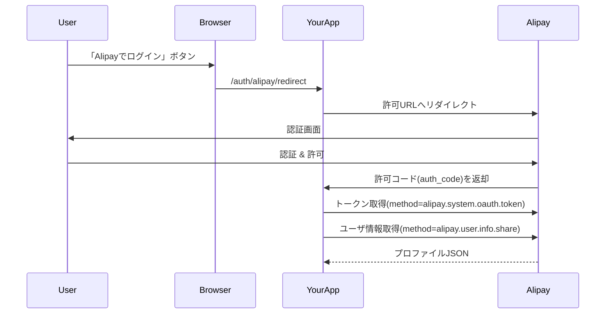

# Alipay 中国向け OAuth の特徴

## 概要
- Alipay（支付宝）は中国最大級の決済プラットフォームであり、OAuth 2.0 による外部サービス認証機能を提供しています。
- ただし、AlipayのOAuthはREST形式ではなく、独自仕様のAPI構造（methodパラメータ形式）と署名付きリクエストによって処理されるのが特徴です。 
- 他のプロバイダ（Google, Appleなど）と比較して、実装には独自ロジックが必要となります。

---

- エンドポイント
```bash
# method=alipay.user.info.share を指定
POST https://openapi.alipay.com/gateway.do
```
- 主なクエリパラメーター（すべて必須）

| パラメーター       | 内容                        |
| ------------ | ------------------------- |
| `method`     | `alipay.user.info.share`  |
| `auth_token` | アクセストークン                  |
| `app_id`     | Alipay で発行されたアプリケーション ID  |
| `charset`    | `utf-8`                   |
| `sign_type`  | `RSA2`                    |
| `timestamp`  | `YYYY-MM-DD HH:mm:ss`     |
| `version`    | `1.0`                     |
| `sign`       | 送信パラメーター全体を RSA2 で署名した文字列 |

>リクエストは application/x-www-form-urlencoded 形式で POST


- レスポンス（正常時）
```json
{
  "alipay_user_info_share_response": {
    "code": "10000",
    "msg": "Success",
    "user_id": "2088102122524333",
    "user_name": "山田 太郎",
    "gender": "M",
    "province": "Tokyo",
    "city": "Minato",
    "nick_name": "Taro",
    "avatar": "http://tfsimg.alipay.com/images/partner/xxx.jpg"
  },
  "sign": "abc123..."
}
```
- フィールド一覧

| フィールド名      | 内容                  |
| ----------- | ------------------- |
| `user_id`   | Alipay 側で一意のユーザー ID |
| `user_name` | フルネーム               |
| `gender`    | 性別 (`M`/`F`)        |
| `province`  | 都道府県                |
| `city`      | 市区町村                |
| `nick_name` | ニックネーム              |
| `avatar`    | プロフィール画像の URL       |

#### 「エンドポイント」「クエリ／パラメーター」「レスポンス」「フィールド仕様」が確認できる公式ドキュメントまとめ

- [アクセストークン取得 (method=alipay.system.oauth.token)](https://opendocs.alipay.com/apis/api_9/alipay.system.oauth.token)

- [ユーザー情報取得 (method=alipay.user.info.share)](https://opendocs.alipay.com/apis/api_2/alipay.user.info.share)

- [Gateway 全体仕様](https://opendocs.alipay.com/common/02kh7h)
- [Gateway 署名ルール](https://opendocs.alipay.com/common/02kf5q)

---

## 認証フロー概要

```mermaid
sequenceDiagram
    participant User
    participant Browser
    participant YourApp
    participant Alipay

    User->>Browser: 「Alipayでログイン」ボタン
    Browser->>YourApp: /auth/alipay/redirect
    YourApp->>Alipay: 許可URLへリダイレクト
    Alipay->>User: 認証画面
    User->>Alipay: 認証 & 許可
    Alipay->>YourApp: 許可コード(auth_code)を返却
    YourApp->>Alipay: トークン取得(method=alipay.system.oauth.token)
    YourApp->>Alipay: ユーザ情報取得(method=alipay.user.info.share)
    Alipay-->>YourApp: プロファイルJSON
```

## OAuth 基本構成

- 認可URL:
```text
https://openauth.alipay.com/oauth2/publicAppAuthorize.htm
```
- トークン取得:
```text
POST https://openapi.alipay.com/gateway.do
method=alipay.system.oauth.token

```
- ユーザ情報取得:
```text
POST https://openapi.alipay.com/gateway.do
method=alipay.user.info.share

```

## トークン取得リクエスト

- 必須パラメータ

|パラメーター| 説明                          |
|---|-----------------------------|
|method| alipay.system.oauth.token   |
|grant_type| authorization_code          |
|code| 許可コード                       |
|app_id| AlipayアプリID                 |
|charset| utf-8                       |
|sign_type| RSA2                        |
|timestamp| yyyy-MM-dd HH:mm:ss         |
|version| 1.0                         |
|sign| パラメータ全体を符合した署名              |

>リクエストは application/x-www-form-urlencoded 形式でPOST送信

## ユーザ情報 (alipay.user.info.share)
```text
{
  "alipay_user_info_share_response": {
    "code": "10000",
    "msg": "Success",
    "user_id": "2088102122524333",
    "user_name": "界塚 伊奈帆",
    "gender": "M",
    "province": "Tokyo",
    "city": "Minato",
    "nick_name": "Taro",
    "avatar": "http://tfsimg.alipay.com/images/partner/xxx.jpg"
  },
  "sign": "abc123..."
}
```
- user_id: Alipay ユーザーの一意 ID
- user_name, nick_name: 名前
- avatar: プロファイル画像URL

## 署名ロジック
**Alipay の API は、クエリパラメータの全体を RSA2 で署名する必要があります。**
1. メソッド名を method=xxx の形式で配列
2. 値を URL エンコード せずに組み立て
3. 全体を 自分の私鍵 (PKCS#8) でRSA2署名

## 注意点
- Alipay OAuth は Socialite 本体は未搭載。自作必須
- トークンや情報APIは gateway.do に統一されており、method で分岐
- ローカル開発者の場合、Alipay Global や港澳版とは別パートナーを使用

## まとめ
- Alipay OAuth は独自組みの OAuth + 署名ロジック
- API は gateway.do 統一端点
- 認証後は alipay.user.info.share でプロファイル情報を取得
- Laravel や他のプラットフォームでは、Guzzle/カスタムロジックの実装が必要
- 実装例 : [alipay.rb](../auth-flow-examples/alipay.rb)
