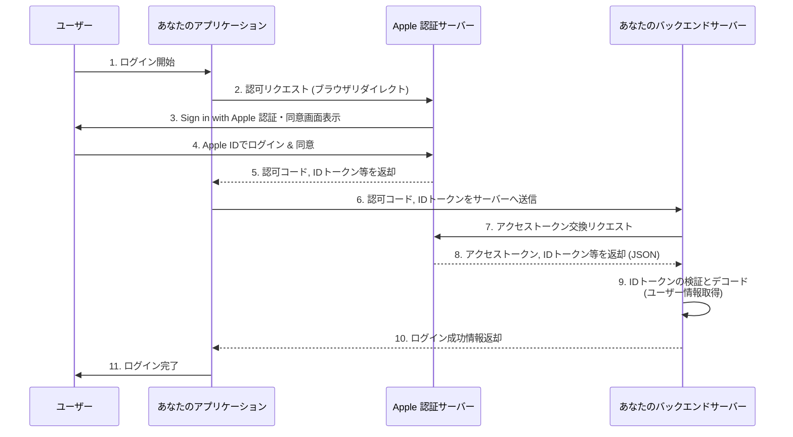
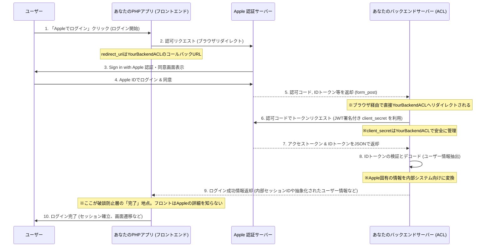

### [ ⏎ 戻る](../index.md)
# Apple OAuth 2.0 認証フロー

**Google とは異なり、専用の userinfo エンドポイントを明示的に提供するのではなく、IDトークン にほとんどのユーザー情報が含まれます。**

---

## 認可エンドポイント (Authorization Endpoint)

### URL:

- `https://appleid.apple.com/auth/authorize`

### 主な必須クエリパラメーター:

- `client_id`: あなたのサービス ID (Service ID)。Apple Developer Portal で作成します。
- `redirect_uri`: 認可コードが送信されるリダイレクト URI。Apple Developer Portal で登録したものと一致する必要があります。HTTPS スキームを使用し、ドメイン名を含める必要があります。
- `response_type`: 取得したいレスポンスのタイプ。認可コードフローでは code を指定します。id_token も含める場合は code%20id_token と指定します。
- `scope`: 要求するユーザー情報の範囲。スペース区切りで複数指定します。
  - **例: openid%20email%20name (openid は OpenID Connect の使用を示す必須スコープ)**
- `name`: ユーザーの名前 (初回認証時のみ返される可能性が高い)
- `email`: ユーザーのメールアドレス (リレーメールアドレスの選択肢あり)
- `state`: クロスサイトリクエストフォージェリ (CSRF) 攻撃を防ぐための任意の文字列。リクエスト時に生成し、レスポンスで返される state と比較して検証します。
- `response_mode`: レスポンスの送信方法。スコープを要求する場合、form_post を使用することが推奨されます。  
  

- **参考ページ ☞**: [`https://developer.apple.com/documentation/signinwithapplerestapi/request-an-authorization-to-the-sign-in-with-apple-server.?changes=_3_3`](https://developer.apple.com/documentation/signinwithapplerestapi/request-an-authorization-to-the-sign-in-with-apple-server.?changes=_3_3)

### 正常時のレスポンス:
- ユーザーがあなたのアプリケーションへのアクセスを許可すると、Apple は redirect_uri にリダイレクトし、response_mode に応じて URL のクエリパラメーターまたは POST リクエストのボディとして以下の情報を含みます。

- `code`: 一時的な認可コード。アクセストークンと交換するために使用します。
- `id_token`: (要求された場合) ユーザーの認証情報を含む JWT。
- `state`: リクエスト時に送信した state パラメーターと同じ値。
- `user`: (初回認証時のみ) ユーザーの name および email 情報を含む JSON 文字列。
  

- **参考ページ ☞**: [`https://developer.apple.com/documentation/signinwithapplerestapi`](https://developer.apple.com/documentation/signinwithapplerestapi)

---

## トークンエンドポイント (Token Endpoint):

### URL:

- `https://appleid.apple.com/auth/token`

### 主な必須クエリパラメーター(POST リクエストのボディに application/x-www-form-urlencoded または application/json 形式で含める):

- `client_id`: あなたのサービス ID (Service ID)。
- `client_secret`: Apple Developer Portal で生成した秘密鍵とキー ID を用いて生成する JSON Web Token (JWT)。この JWT には iss, iat, exp, aud, sub などのクレームが含まれます。
- `code`: 認可エンドポイントから取得した認可コード。
- `grant_type`: authorization_code (認可コードをアクセストークンと交換する場合) または refresh_token (リフレッシュトークンを使用してアクセストークンを更新する場合)。
- `redirect_uri`: 認可コード取得時と同じリダイレクト URI。
  

- **参考ページ ☞**: [`https://developer.apple.com/documentation/signinwithapplerestapi/generate_and_validate_tokens`](https://developer.apple.com/documentation/signinwithapplerestapi/generate_and_validate_tokens)

### 正常時のレスポンス: (JSON 形式で以下のデータが返されます。)

- `access_token`: Google API にアクセスするためのアクセストークン。ただし、Apple の access_token は通常、ユーザー情報の取得には使用されず、アカウントの移行やトークンの失効などの特定の Apple API で利用されます。
- `expires_in`: アクセストークンの有効期限（秒数）。
- `id_token`: ユーザーの認証情報を含む JWT (JSON Web Token)。
- `sub`: (Subject) Appleアカウント全体で一意のユーザーID。これが主要なユーザーIDとなります。
- `email`: ユーザーのメールアドレス。
- `email_verified`: メールアドレスが確認済みかどうか (boolean)。
- `is_private_email`: プライベートリレーメールアドレスが使用されているかどうか (boolean)。
- `auth_time`: 認証が行われた時刻 (Unixタイムスタンプ)。
- `iss`: 発行者 (`https://appleid.apple.com`)
- `aud`: サービス利用者（あなたのアプリケーションのクライアントID）
- `exp`: 有効期限 (Unixタイムスタンプ)
- `iat`: 発行時刻 (Unixタイムスタンプ)
- `nonce`: (要求された場合) リクエスト時に送信した nonce 値。
- `refresh_token`: 新しいアクセストークンを取得するためのトークン。
- `token_type`: Bearer。
  

- **参考ページ ☞**: [`https://developer.apple.com/documentation/signinwithapplerestapi/tokenresponse`](https://developer.apple.com/documentation/signinwithapplerestapi/tokenresponse)

---

## Userinfo エンドポイント (Userinfo Endpoint):
- **Apple の "Sign in with Apple" は、Google のように明示的な userinfo エンドポイントを提供していません。** 
- **ユーザーの基本的な情報（ユーザーID、メールアドレス、名前など）は、トークンエンドポイントから返される id_token の内容をデコードすることで取得します。**

---

## 重要な注意点:
- ユーザーの氏名とメールアドレスは、初回認証時のみ認可エンドポイントのレスポンス (または id_token) に含まれる可能性が高い。
  - 2回目以降の認証では、ユーザーはこれらの情報の提供をスキップすることができます。なので、これらの情報は初回ログイン時に取得し、アプリケーションのデータベースに保存することが推奨されているようです。
- `client_secret` は、サーバーサイドで生成される JWT であり、有効期限を短く設定して定期的に更新する必要があり。また、秘密鍵は厳重に管理する必要も。

---

# 破談防止層の役割を明確にしたシーケンス図

### 破断防止層を導入することで、アプリケーションのコアロジックは外部サービスの具体的な実装詳細から切り離され、保守性や拡張性が向上します。

- 特徴：
  - セキュリティ要件が非常に高く、トークン交換とIDトークン検証をバックエンドサーバーで行うことを強く推奨

- ACLの役割：
  - フロントエンド側ACL：ユーザーをAppleの認証サーバーにリダイレクトし、認可コードとIDトークンの初期応答を受け取ります。これらを安全にバックエンドACLに転送
  - バックエンド側ACL（中核）： 
    - client_secret（JWT署名形式）を安全に管理し、これを用いてAppleのトークンエンドポイントと通信し、アクセストークンとリフレッシュトークンを交換
    - Appleから返却されるIDトークンの署名を厳密に検証・デコードし、ユーザー情報を抽出
    - Apple固有のユーザー情報（例: user_id, emailなど）を内部システムが利用しやすい形式に変換

- ポイント：
  - ACLの機能がフロントエンドとバックエンドに分散する傾向があり、バックエンドでのclient_secretの安全な管理とIDトークンの厳密な検証が最も重要

---

## ACLから情報を取得する固有のアクセストークン集約リポジトリアダプターという観点でOAuthエンドポイントと関連情報を整理

---
# 参考資料まとめ

- Apple "Sign in with Apple" の公式サイトと各エンドポイントの詳細: 
  - [`https://developer.apple.com/documentation/signinwithapplerestapi`](https://developer.apple.com/documentation/signinwithapplerestapi)
  

- ユーザーの認証、ユーザーの ID トークンの有効性と整合性を確認:
  - [`https://developer.apple.com/documentation/signinwithapple/verifying-a-user`](https://developer.apple.com/documentation/signinwithapple/verifying-a-user)
  

- Sign in with Appleサーバーに認証をリクエスト
  - [`https://developer.apple.com/documentation/signinwithapplerestapi/request-an-authorization-to-the-sign-in-with-apple-server.?changes=_3_3`](https://developer.apple.com/documentation/signinwithapplerestapi/request-an-authorization-to-the-sign-in-with-apple-server.?changes=_3_3)
  

- Apple REST APIでサインイン
  - [`https://developer.apple.com/documentation/signinwithapplerestapi`](https://developer.apple.com/documentation/signinwithapplerestapi)
  

- トークンの生成と検証
  - [`https://developer.apple.com/documentation/signinwithapplerestapi/generate_and_validate_tokens`](https://developer.apple.com/documentation/signinwithapplerestapi/generate_and_validate_tokens)
  

- トークンレスポンス
  - [`https://developer.apple.com/documentation/signinwithapplerestapi/tokenresponse`](https://developer.apple.com/documentation/signinwithapplerestapi/tokenresponse)
  

### [ ⏎ 戻る](../index.md)
