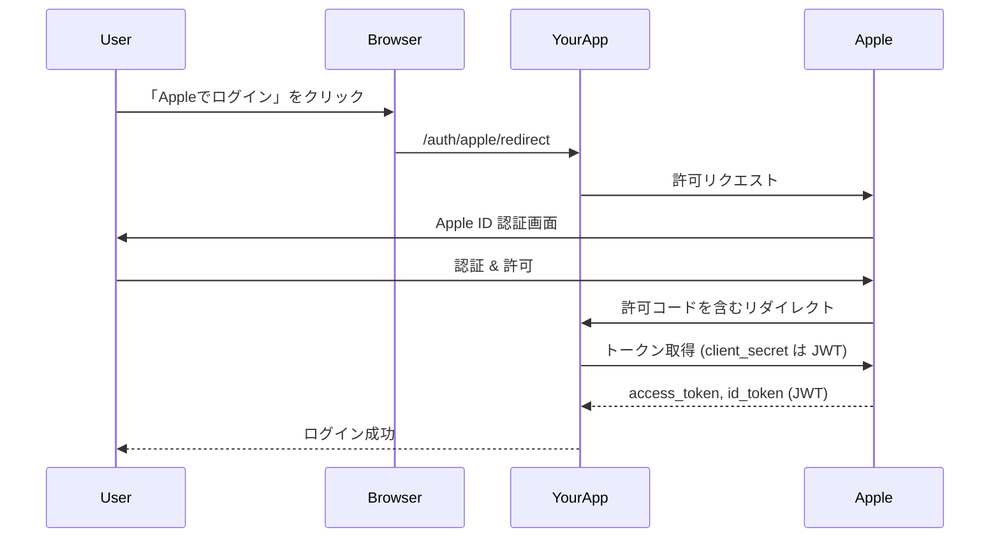

# Apple OAuth (Sign in with Apple) の仕様と実装ポイント

## 🔍 概要
- "Sign in with Apple" は、Apple ID を使ってアプリケーションやウェブサービスに安全にログインできる仕組みです。
- OAuth 2.0 および OpenID Connect (OIDC) をベースとしていますが、他のプロバイダと異なり、JWT署名によるクライアントシークレット生成や、初回ログイン時のみ取得可能なユーザー情報など、Apple特有の仕様があります。

---

- エンドポイント
**ユーザー情報用の明示的な userinfo API はなく、 まずトークン取得後に ID トークン (JWT) をデコードして情報を取得します。**
```bash
POST https://appleid.apple.com/auth/token
```
- 主なクエリパラメーター（すべて必須）

| パラメーター          | 内容                               |
| --------------- | -------------------------------- |
| `client_id`     | Apple Developer で発行したサービス ID     |
| `client_secret` | Team ID／Key ID／プライベートキーで生成した JWT |
| `code`          | 認可サーバーから渡される認可コード                |
| `grant_type`    | `authorization_code`             |
| `redirect_uri`  | 事前登録済みのリダイレクト URI                |

- レスポンス例（正常時）
```json
{
  "access_token": "eyJhbGciOiJIUzI1NiIsInR5cCI6IkpXVCJ9...",
  "expires_in": 3600,
  "id_token": "eyJraWQiOiJ...<JWT>..."
}
```
- フィールド一覧（ID トークンをデコードした結果）

| クレーム名              | 内容                                 |
| ------------------ | ---------------------------------- |
| `iss`              | 発行者 (`https://appleid.apple.com`)  |
| `sub`              | Apple 側で一意のユーザー ID                 |
| `aud`              | クライアント ID                          |
| `exp`              | JWT の有効期限（Unix タイムスタンプ）            |
| `iat`              | JWT の発行日時（Unix タイムスタンプ）            |
| `email`            | ユーザーのメールアドレス（初回ログイン時のみ）            |
| `email_verified`   | メールが認証済みかどうか (`true`/`false`)      |
| `is_private_email` | Relay メールアドレスかどうか (`true`/`false`) |


---
## ✅ 認証フロー概要


```mermaid
sequenceDiagram
    participant User
    participant Browser
    participant YourApp
    participant Apple

    User->>Browser: 「Appleでログイン」をクリック
    Browser->>YourApp: /auth/apple/redirect
    YourApp->>Apple: 許可リクエスト
    Apple->>User: Apple ID 認証画面
    User->>Apple: 認証 & 許可
    Apple->>YourApp: 許可コードを含むリダイレクト
    YourApp->>Apple: トークン取得 (client_secret は JWT)
    Apple-->>YourApp: access_token, id_token (JWT)
    YourApp-->>User: ログイン成功
```
## ⚙️ OAuth 2.0 基本構成

| 項目   | 　値                                       |
|------|------------------------------------------|
| 認可URL | https://appleid.apple.com/auth/authorize |
| トークンURL | https://appleid.apple.com/auth/token     |
|    OIDC Discovery  |    https://appleid.apple.com/.well-known/openid-configuration  |


## ὑ1 必須スコープ
```text
openid email name
```
- email: Apple ID のメールアドレス（初回のみ返る）
- name: ユーザーの氏名（初回のみ返る）
- ※ 2回目以降は sub（Apple ユーザーIDとして一意な値、ID token に含まれる）のみ

## 📄 ID Token (JWT) の例
```text
{
  "iss": "https://appleid.apple.com",
  "sub": "00112233445566778899.aaa.bbb.ccc",
  "aud": "com.example.app",
  "exp": 1712345678,
  "iat": 1712345670,
  "email": "user@example.com",
  "email_verified": "true",
  "is_private_email": "true"
}
```
- sub: Apple側の一意のユーザーID
- email_verified: 認証済メール
- is_private_email: リレーメールアドレスかどうか

## 🔒 client_secret (自己署名 JWT)
**Apple OAuth では client_secret を JWT で自己署名する必要があります:**
- 診断情報:
  - iss: Apple Developer チームID (team_id)
  - iat / exp: JWT 発行日 / 有効期限
  - aud: https://appleid.apple.com
  - sub: client_id
- 署名: ES256 (非同期化鍵)

## ⚠️ 注意点
- 初回のログインでしか email や name は取得できない
- 2回目以降は ID Token から sub を認証IDとして利用
- リレーメールアドレスの場合、email は Apple 側のプロキシーメール
- Apple 側による email relay を利用したい場合は DNS/SPF 設定も要検討

## 🔹 まとめ
- Apple OAuth は JWT署名など特有の実装が必要
- ユーザー情報は初回の認証時のみ取得可能
- 認証後は ID Token (JWT) を解析し、subを利用
- Laravel Socialite での実装例は [apple.php](../auth-flow-examples/apple.php) を参照
