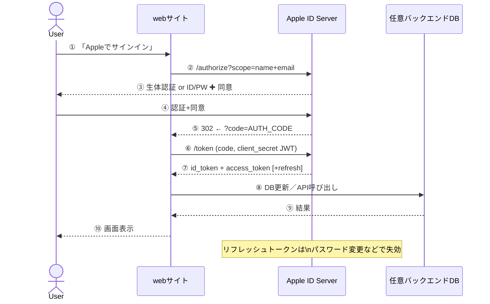

### [ ⏎ 戻る](../index.md)
# Apple Sign in with Apple認証とユーザー情報取得

## OAuth認証フロー

- **Sign in with Appleは、OAuth 2.0およびOpenID Connectプロトコルに準拠**


```mermaid
sequenceDiagram
  actor User
  participant Site as webサイト
  participant AppleAuth as Apple ID Server
  participant Res as 任意バックエンドDB

  User->>Site: ① 「Appleでサインイン」
  Site->>AppleAuth: ② /authorize?scope=name+email
  AppleAuth-->>User: ③ 生体認証 or ID/PW ✚ 同意
  User->>AppleAuth: ④ 認証+同意
  AppleAuth-->>Site: ⑤ 302 ← ?code=AUTH_CODE
  Site->>AppleAuth: ⑥ /token (code, client_secret JWT)
  AppleAuth-->>Site: ⑦ id_token + access_token [+refresh]
  Site->>Res: ⑧ DB更新／API呼び出し
  Res-->>Site: ⑨ 結果
  Site-->>User: ⑩ 画面表示
  Note over AppleAuth: リフレッシュトークンは\nパスワード変更などで失効

```
---
### ログインしているユーザーIDを安全に取得するための、最も推奨される、そして最終的に最も確実なステップ

#### [ユーザーID取得方法へ](../allowed-code-flows/apple_user_id.md)


---
## webサイトからサーバーに向けて打つAPIの回数

- 回数：2 回

## それぞれのAPIのエンドポイントと正常時のレスポンス

## GET https://appleid.apple.com/auth/authorize

### 用途：
- ユーザーを Apple IDのログイン＋同意画面 にリダイレクトする
- 認可コード (code) と IDトークン (id_token) を取得するための第一段階

### 必要なパラメータ（URLクエリ）

| 要素                            | 説明                                               |
| ----------------------------- | ------------------------------------------------ |
| `client_id`                   | Services ID（Apple Developer Portal で発行されたアプリ識別子） |
| `redirect_uri`                | 認可後に `code` 等を返すコールバック URL（事前登録済み）               |
| `response_type=code id_token` | 認可コードと IDトークンの両方を要求する固定値                         |
| `scope=name email`            | 取得するユーザー情報の範囲（フルネームとメールアドレス）                     |
| `response_mode=form_post`     | 結果を HTTP POST ボディで返す指定（省略時はURLクエリ）               |
| `state`                       | CSRF 攻撃を防ぐランダム文字列                                |
| `nonce`                       | `id_token` の正当性検証用ランダム文字列                        |


### 認可エンドポイントからの リダイレクト／POST レスポンス(/auth/authorize)
- ステータス：
  - 302 Found＋HTML自動 POST フォーム返却
- 送信方式：
  - response_mode=form_post 設定時：
    - Appleサーバーが <form method="post" action="redirect_uri"> を返し、自動的に POST 実行
  - （省略時は URL クエリでの 302 リダイレクト）
- 返却パラメータ（POST body）：
  - code：認可コード
  - id_token：JWT（ユーザー ID や email を含む）
  - state：CSRF 用文字列
  - user：初回のみ <JSON> 形式で { name:{…}, email:… }

- エラー時（POST body）：
```text
error=access_denied
error_description=The+user+denied+authorization
state=...
```
- 注)：
  - クライアントは必ずフォーム POST の受信を許可し、URLでトークンを漏洩させないこと
  - user 情報は初回のみ。永続的に保存すること。


---
## POST https://appleid.apple.com/auth/token

### 用途：
- 認可コード（code）を使って access_token, refresh_token, id_token を取得


## 必要なパラメータ（POST body, application/x-www-form-urlencoded）

```json
{
  "access_token": "...",   // Apple API 呼び出し用の短命トークン
  "expires_in": 3600,      // access_token の有効期間（秒）
  "token_type": "Bearer",
  "refresh_token": "...",  // パスワード変更等イベントでのみ失効する長命トークン
  "id_token": "..."        // JWT (ユーザーID, email などを内包)
}
```

- **補足：id_token の中身（デコード例）**
```json
{
"iss": "https://appleid.apple.com",
"sub": "000000.abcde12345",         // Apple 内でアプリ＋ユーザーを一意に識別
"aud": "com.example.app",
"email": "user@privaterelay.appleid.com",
"email_verified": "true",
"auth_time": 1680000000,
"nonce_supported": true
}
```
- 初回ログイン時のみ、user フィールドに name と email 情報が含まれる（再取得不可）。
- /userinfo相当の API は存在せず、IDトークンをデコードして取得する。

### [ ⏎ 戻る](../index.md)
