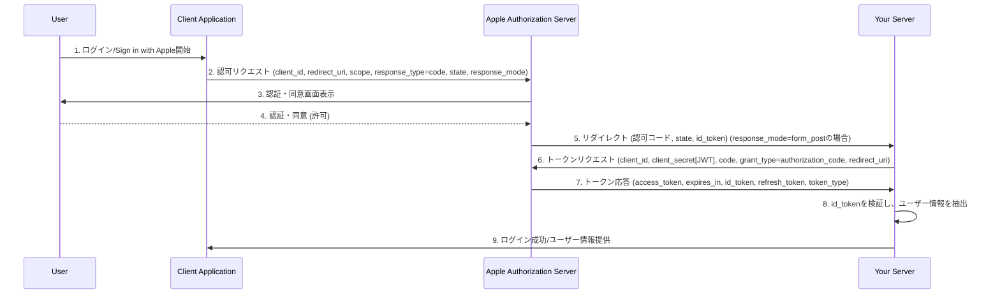

# Apple Sign in with Apple認証とユーザー情報取得

## OAuth認証フロー

- **Sign in with Appleは、OAuth 2.0およびOpenID Connectプロトコルに準拠**


```mermaid
sequenceDiagram
    participant User
    participant ClientApp as Client Application
    participant AppleAuth as Apple Authorization Server
    participant YourServer as Your Server

    User->>ClientApp: 1. ログイン/Sign in with Apple開始
    ClientApp->>AppleAuth: 2. 認可リクエスト (client_id, redirect_uri, scope, response_type=code, state, response_mode)
    AppleAuth->>User: 3. 認証・同意画面表示
    User-->>AppleAuth: 4. 認証・同意 (許可)
    AppleAuth->>YourServer: 5. リダイレクト (認可コード, state, id_token) (response_mode=form_postの場合)
    YourServer->>AppleAuth: 6. トークンリクエスト (client_id, client_secret[JWT], code, grant_type=authorization_code, redirect_uri)
    AppleAuth->>YourServer: 7. トークン応答 (access_token, expires_in, id_token, refresh_token, token_type)
    YourServer->>YourServer: 8. id_tokenを検証し、ユーザー情報を抽出
    YourServer->>ClientApp: 9. ログイン成功/ユーザー情報提供
```

## エンドポイントと主なクエリパラメータ

- 認可エンドポイント
  - URL: https://appleid.apple.com/auth/authorize
  - HTTPメソッド: GET
  - 主な必須クエリパラメータ:
    - client_id: サービスID（com.example.service のような形式）
    - redirect_uri: 認証後にユーザーがリダイレクトされるURL。Apple Developer Consoleで設定したものと一致する必要があります。
    - response_type: code を指定。
    - scope: name と email をスペース区切りで指定できます。例: name email。
    - state: CSRF攻撃を防ぐための任意の文字列。
    - response_mode: form_post (推奨、POSTリクエストで認可コードとIDトークンを返却) または query (GETリクエストで返却)。
- トークンエンドポイント
  - URL: https://appleid.apple.com/auth/token
  - HTTPメソッド: POST
  - 主な必須リクエストボディパラメータ (application/x-www-form-urlencoded):
    - client_id: サービスID。
    - client_secret: 生成されたJWT (JSON Web Token) のクライアントシークレット。
    - code: 認可エンドポイントから取得した認可コード。
    - grant_type: authorization_code (認可コードを交換する場合) または refresh_token (リフレッシュトークンで新しいアクセストークンを取得する場合)。
    - redirect_uri: 認可エンドポイントで使用したものと同じリダイレクトURI。

## レスポンス（正常時）

- トークンエンドポイントへのリクエストが成功すると、以下の情報を含むJSON形式のレスポンスが返されます。

```json
{
  "access_token": "a_valid_access_token",
  "expires_in": 3600,
  "id_token": "a_valid_id_token.jwt.string",
  "refresh_token": "a_valid_refresh_token",
  "token_type": "Bearer"
}
```
- access_token: APIリクエストに用いるアクセストークン（短命）。
- expires_in: アクセストークンの有効期間（秒）。
- id_token: ユーザーの認証情報と基本プロファイル情報を含むJWT。
- refresh_token: 新しいアクセストークンを取得するためのリフレッシュトークン。
- token_type: トークンの種類。

## ユーザー情報取得APIエンドポイントと仕様概要

- **AppleのSign in with Appleでは、ユーザーのプロファイル情報（名前、メールアドレス）は主にid_token（JWT）から取得します。専用のユーザー情報取得APIエンドポイントは提供されていません。**
  - id_tokenに含まれるクレーム
  - id_tokenはJWT形式であり、そのペイロードには以下のクレームが含まれます。

|クレーム名|	概要|	備考|
|---|---|---|
|iss|	発行者 (Issuer)。https://appleid.apple.com||
|sub|	サブジェクト (Subject)。Appleが提供するユーザーの一意な識別子。この値がユーザーを識別するための唯一の永続的な識別子です。||
|aud|	オーディエンス (Audience)。サービスID（client_id）||
|exp|	有効期限 (Expiration Time)。JWTの有効期限（Unix時間）。||
|iat|	発行時間 (Issued At)。JWTが発行された時間（Unix時間）。||
|email|	ユーザーのメールアドレス。|	ユーザーが「メールを非公開」を選択した場合、Appleが生成したプライベートリレーメールアドレス（@privaterelay.appleid.comドメイン）が提供されます。|
|email_verified|	メールアドレスが検証済みであるかを示すブーリアン値。||
|is_private_email|	提供されたメールアドレスがプライベートリレーメールアドレスであるかを示すブーリアン値。||
|auth_time|	認証時間。ユーザーがAppleに認証された時間（Unix時間）。||
|name|	ユーザーの名前。JSONオブジェクトでfirstNameとlastNameを含む。|	重要: nameクレームは、初回認証時にのみscope=nameが指定された場合にのみ提供されます。2回目以降の認証では、ユーザーが名前を更新してもこのクレームは提供されません。アプリケーションは初回認証時に名前を取得し、サーバー側で保存する必要があります。|


## アクセストークンとリフレッシュトークン

- アクセストークン: 短命で、APIリクエストの認証に使用されます。具体的な有効期限は明示されていませんが、id_tokenのexpクレームで示される有効期限を参考に検証します。
- リフレッシュトークン: 長期間有効ですが、ユーザーがアクセスの取り消しを行ったり、パスワードを変更したりすると無効になる可能性があります。リフレッシュトークンの検証は、最低でも1日1回行うことが推奨されています。

## エラーハンドリング

- トークン交換などのAPI呼び出しでエラーが発生した場合、以下のフィールドを含むJSON形式のレスポンスが返されます。
```json
{
  "error": "error_code",
  "error_description": "human_readable_description"
}
```
- 一般的なエラーコード:
  - invalid_request: リクエストパラメータが無効または不足している。
  - invalid_client: クライアント認証に失敗した。
  - invalid_grant: 認可コードが無効、期限切れ、またはすでに使用済みである。
  - unauthorized_client: クライアントが指定された認証フローを使用する権限がない。
  - unsupported_grant_type: サポートされていないグラントタイプが指定された。
  - invalid_scope: リクエストされたスコープが無効または不正である。

---

## [OAuth認証におけるエンドポイント、主なクエリパラメーター、およびレスポンスを確認できる公式ドキュメントへ ☞](https://developer.apple.com/documentation/signinwithapple)
