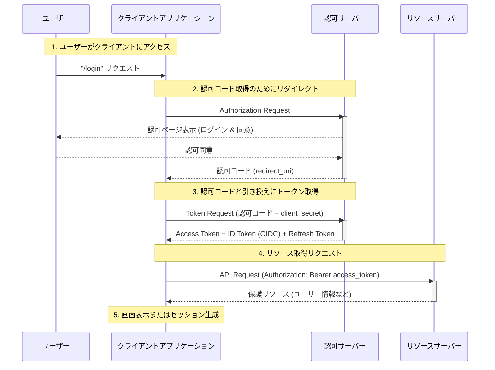

```mermaid
sequenceDiagram
    participant ユーザー
    participant Client as クライアントアプリケーション
    participant AuthServer as 認可サーバー
    participant ResourceServer as リソースサーバー

    Note over ユーザー, Client: 1. ユーザーがクライアントにアクセス
    ユーザー->>Client: "/login" リクエスト

    Note over Client, AuthServer: 2. 認可コード取得のためにリダイレクト
    Client->>AuthServer: Authorization Request
    activate AuthServer
    AuthServer-->>ユーザー: 認可ページ表示 (ログイン & 同意)
    ユーザー-->>AuthServer: 認可同意
    AuthServer-->>Client: 認可コード (redirect_uri)
    deactivate AuthServer

    Note over Client, AuthServer: 3. 認可コードと引き換えにトークン取得
    Client->>AuthServer: Token Request (認可コード + client_secret)
    activate AuthServer
    AuthServer-->>Client: Access Token + ID Token (OIDC) + Refresh Token
    deactivate AuthServer

    Note over Client, ResourceServer: 4. リソース取得リクエスト
    Client->>ResourceServer: API Request (Authorization: Bearer access_token)
    activate ResourceServer
    ResourceServer-->>Client: 保護リソース (ユーザー情報など)
    deactivate ResourceServer

    Note over Client: 5. 画面表示またはセッション生成
```

