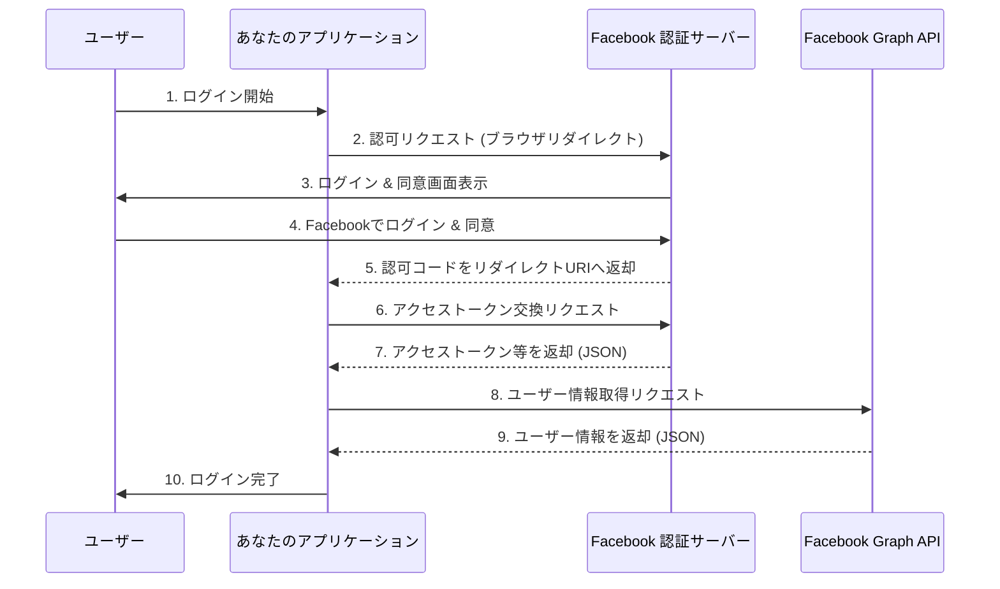
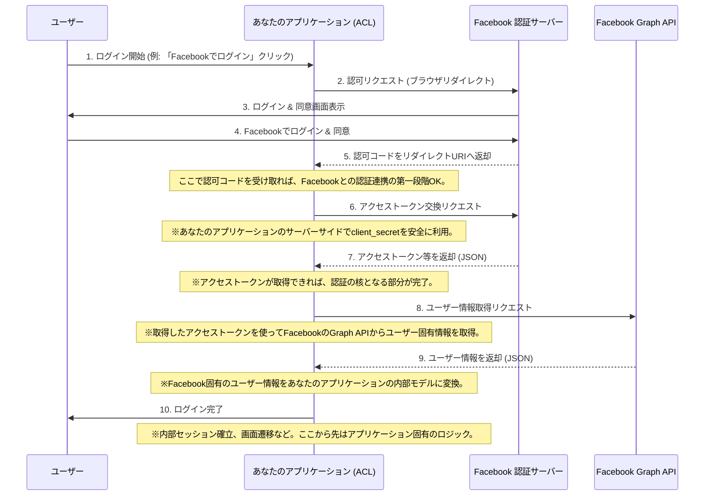

### [ ⏎ 戻る](../index.md)
# Facebook OAuth 2.0 認証フロー

**Facebook の OAuth 2.0 認証フローは、Meta for Developers のドキュメントで提供されています。**
**主にウェブ、モバイル、デスクトップアプリケーション向けに異なるフローがありますが、ここでは一般的な「ウェブアプリケーションからのログイン」を想定して説明します。**

---

## 認可エンドポイント (Authorization Endpoint)

**ユーザーが Facebook ログインダイアログを通じてアプリケーションに許可を与えるためのエンドポイントです。**

### URL:

- `https://www.facebook.com/v19.0/dialog/oauth`   
  

**バージョン部分は適宜変更して使用すること。**

### 主な必須クエリパラメーター:

- `client_id`: あなたのアプリ ID (App ID)。Meta for Developers でアプリを登録すると発行されます。
- `redirect_uri`: 認可コード (またはアクセストークン) が送信されるリダイレクト URI。Meta for Developers のアプリ設定で登録したものと完全に一致する必要があります。
- `response_type`: 取得したいレスポンスのタイプ。
- `code`: (推奨、サーバーサイドアプリケーション向け) 認可コードを取得します。
- `token`: (非推奨、クライアントサイド向け) アクセストークンを直接取得します。
- `code%20token`: 両方を取得します。
- `scope`: 要求するユーザー情報の範囲 (パーミッション)。カンマ区切りで複数指定します。
  - 例: public_profile,email
- `public_profile`: ユーザーの公開プロフィールと友だちリストへのアクセス (デフォルト)。ユーザー ID、名前などが含まれます。
- `email`: ユーザーのメールアドレスへのアクセス。
- その他、様々なパーミッションがあります。
- `state`: CSRF 対策として必須。リクエストごとにアプリケーション側で生成した十分な長さのランダムな文字列。レスポンスで返される state と比較して検証します。
  

- **参考ページ ☞**: - [`https://developers.facebook.com/docs/facebook-login/guides/advanced/manual-flow`](https://developers.facebook.com/docs/facebook-login/guides/advanced/manual-flow)

### 正常時のレスポンス:

**ユーザーが許可すると、redirect_uri にリダイレクトされ、URL のクエリパラメーターとして以下の情報を含みます。**

- `code`: (response_type=code の場合) 認可コード。アクセストークンと交換するために使用します。
- `access_token`: (response_type=token または code%20token の場合) クライアントサイドからの利用に限定される短期アクセストークン。
- `expires_in`: (response_type=token または code%20token の場合) アクセストークンの有効期限（秒）。
- `state`: リクエスト時に送信した state パラメーターと同じ値。

---

## アクセストークンエンドポイント (Access Token Endpoint)

**認可コードを永続的なアクセストークンに交換するためのエンドポイントです。**

### URL:

- `https://graph.facebook.com/v19.0/oauth/access_token`
  
**バージョン部分は適宜変更を**

### 主な必須クエリパラメーター (GET リクエスト):

- `client_id`: あなたのアプリ ID。
- `redirect_uri`: 認可エンドポイントで使用したリダイレクト URI と同じもの。
- `client_secret`: あなたのアプリシークレット (App Secret)。Meta for Developers でアプリを登録すると発行されます。
- `code`: 認可エンドポイントから取得した認可コード。

- **参考ページ ☞**: [`https://developers.facebook.com/docs/facebook-login/guides/advanced/manual-flow`](https://developers.facebook.com/docs/facebook-login/guides/advanced/manual-flow)

### 正常時のレスポンス:
**JSON 形式で以下のデータが返されます。**

- `access_token`: Facebook Graph API にアクセスするためのアクセストークン。デフォルトでは短期 (約1時間) ですが、ユーザーごとに長期 (約60日) のものに交換することもできます。
- `token_type`: 通常は bearer。
- `expires_in`: アクセストークンの有効期限（秒）。

---

## ユーザー情報取得 (Graph API)

**Facebook の場合、OpenID Connect のような専用の userinfo エンドポイントは提供されず、Graph API を通じてユーザー情報を取得します。ユーザー ID はアクセストークンから派生させるか、Graph API から取得します。**

### URL:

- `https://graph.facebook.com/v19.0/me` 
  
**バージョン部分は適宜変更を**

### 主な必須クエリパラメーター (GET リクエスト):

- `access_token`: アクセストークンエンドポイントから取得したアクセストークン。
- `fields`: 取得したいフィールドをカンマ区切りで指定します。
  - 例: id,name,email,picture
- `id`: Facebook アプリケーション全体で一意のユーザー ID。これが主要なユーザー ID となります。
- `name`: ユーザーのフルネーム。
- `email`: ユーザーのメールアドレス (メールパーミッションがある場合)。
- `picture`: ユーザーのプロフィール画像の URL。

- **参考ページ ☞**:
- [`https://developers.facebook.com/docs/graph-api/reference/user/`](https://developers.facebook.com/docs/graph-api/reference/user/)
- [`https://developers.facebook.com/docs/facebook-login/guides/access-tokens`](https://developers.facebook.com/docs/facebook-login/guides/access-tokens)

### 正常時のレスポンス:

**JSON 形式でユーザー情報が返されます。返されるデータは、アクセストークンに付与されたパーミッションと fields パラメーターによって異なります。**

- `id`: Facebook アプリケーション全体で一意のユーザー ID。
- `name`: ユーザーのフルネーム。
- `email`: ユーザーのメールアドレス (パーミッションがある場合)。
- `picture`: ユーザーのプロフィール画像のデータ (data オブジェクト内に url や height, width など)。

---
# 破談防止層の視点から

### 破断防止層を導入することで、アプリケーションのコアロジックは外部サービスの具体的な実装詳細から切り離され、保守性や拡張性が向上します。

- 特徴：
  - 標準的なOAuth 2.0の認可コードフローに準拠

- ACLの役割：
  - 認可コードの受け取りとアクセストークン交換をサーバーサイドで行う
  - client_secretはサーバーサイドで安全に管理
  - 取得したアクセストークンを用いてFacebook Graph APIを呼び出し、ユーザーのプロファイル情報などを取得
  - Facebook Graph APIから返されるユーザー情報を、内部システムが利用しやすい形式に変換

- ポイント：
  - GoogleやYahoo! JAPANと類似しており、client_secretの安全な管理とGraph APIからの情報取得・変換がACLの主な役割

---

## ACLから情報を取得する固有のアクセストークン集約リポジトリアダプターという観点でOAuthエンドポイントと関連情報を整理

---

# 参考資料まとめ

- Facebook ログイン (Meta for Developers):
  - [`https://developers.facebook.com/docs/facebook-login`](https://developers.facebook.com/docs/facebook-login)
  

- ログインフローを手動で構築する:
  - [`https://developers.facebook.com/docs/facebook-login/guides/advanced/manual-flow`](https://developers.facebook.com/docs/facebook-login/guides/advanced/manual-flow)
  

- ユーザーのプロフィールを取得 | Meta for Developers :
  - [`https://developers.facebook.com/docs/graph-api/reference/user/`](https://developers.facebook.com/docs/graph-api/reference/user/)
  

- Metaのテクノロジーのアクセストークン:
  - [`https://developers.facebook.com/docs/facebook-login/guides/access-tokens`](https://developers.facebook.com/docs/facebook-login/guides/access-tokens)
  

### [ ⏎ 戻る](../index.md)