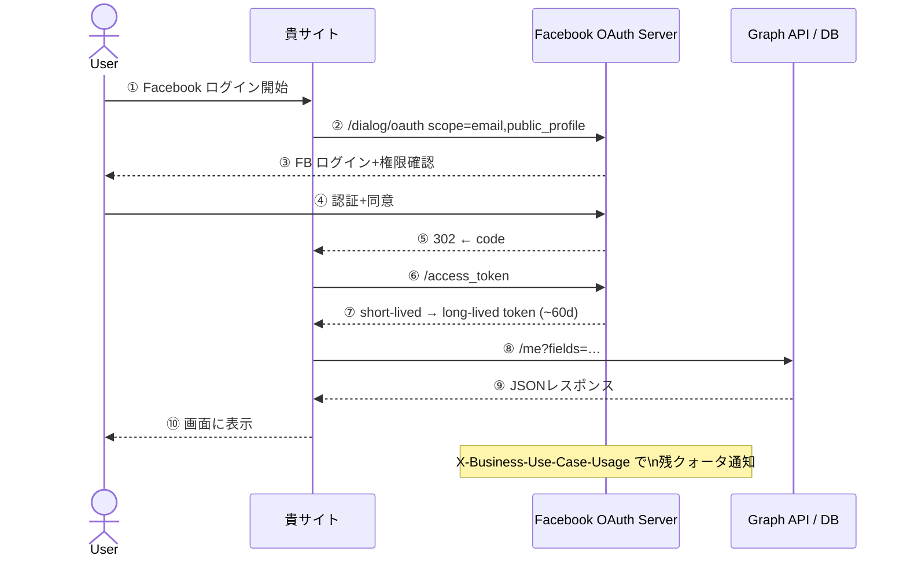

### [ ⏎ 戻る](../index.md)
# Facebook OAuth認証とユーザー情報取得


## OAuth認証フロー


```mermaid
sequenceDiagram
    actor User
    participant Site as 貴サイト
    participant FAuth as Facebook OAuth Server
    participant Graph as Graph API / DB

    User->>Site: ① Facebook ログイン開始
    Site->>FAuth: ② /dialog/oauth scope=email,public_profile
    FAuth-->>User: ③ FB ログイン+権限確認
    User->>FAuth: ④ 認証+同意
    FAuth-->>Site: ⑤ 302 ← code
    Site->>FAuth: ⑥ /access_token
    FAuth-->>Site: ⑦ short-lived → long-lived token (~60d)
    Site->>Graph: ⑧ /me?fields=…
    Graph-->>Site: ⑨ JSONレスポンス
    Site-->>User: ⑩ 画面に表示
    Note over FAuth: X-Business-Use-Case-Usage で\n残クォータ通知

```
---
### ログインしているユーザーIDを安全に取得するための、最も推奨される、そして最終的に最も確実なステップ

#### [ユーザーID取得方法へ](../allowed-code-flows/facebook_user_id.md)


---

## webサイトからサーバーに向けて打つAPIの回数
- 回数：3 回

## それぞれのAPIのエンドポイントと正常時のレスポンス

- GET https://www.facebook.com/v19.0/dialog/oauth
### 用途：
- ユーザーを Facebook のログイン＋権限付与画面に誘導
- 認可コード（code）を取得する第一段階

### 必要なパラメータ（URLクエリ）

| 要素                   | 説明                                |
| -------------------- | --------------------------------- |
| `client_id`          | Meta（Facebook）で発行された App ID       |
| `redirect_uri`       | 認可後に `code` を返すコールバック URL（事前登録必須） |
| `response_type=code` | 認可コードフローを指定する固定値                  |
| `scope`              | 要求する権限（例：`email,public_profile`）  |
| `state`              | CSRF 攻撃防止用のランダム文字列                |

### 認可エンドポイントからの リダイレクト／POST レスポンス(/dialog/oauth)
- ステータス：302 Found
- Location ヘッダー：
```text
https://your.site/callback?
  code=AUTH_CODE&
  state=ORIGINAL_STATE
```
- 方式：自動 GET リダイレクト
- 返却パラメータ：
  - code：認可コード
  - state：CSRF トークン

- エラー時：
```text
?error=access_denied&
  error_reason=user_denied&
  error_description=Permissions+
  error_description&
  state=...
```
- 注):
  - error_reason で拒否理由をログに残すとデバッグが楽
  - アプリレビュー後は追加権限要求で再認可が必要


---
- GET https://graph.facebook.com/v19.0/oauth/access_token
### 用途：
- 認可コード（code）を用いて アクセス トークン を取得

### 必要な要素（URLクエリ）

| 要素              | 説明                |
| --------------- | ----------------- |
| `client_id`     | Meta App ID       |
| `client_secret` | Meta App Secret   |
| `redirect_uri`  | 認可時と同一のコールバック URL |
| `code`          | 上段で取得した認可コード      |

### レスポンス（JSON）

```json
{
  "access_token": "EAAJZA...",   // API呼び出しに使用するトークン
  "token_type": "Bearer",        // 認可方式を示す文字列
  "expires_in": 5183944          // トークンの有効期間（秒）
}
```


---
- GET https://graph.facebook.com/v19.0/me?fields=id,name,email
### 用途：
- access_token を用いて ユーザー情報 を取得

### 必要な要素（HTTPヘッダー or URLクエリ）

| 要素              | 説明                                              |
| --------------- | ----------------------------------------------- |
| `Authorization` | `Bearer ACCESS_TOKEN` を HTTP ヘッダーに指定            |
| `access_token`  | （代替）クエリパラメータ `?access_token=ACCESS_TOKEN` としても可 |
| `fields`        | 取得したいプロパティ（例：`id,name,email`）                   |

### レスポンス（JSON）

```json
{
  "id": "1020304050",        // Facebook 内での一意ユーザーID
  "name": "Bob Example",     // ユーザーの表示名
  "email": "bob@example.com" // メールアドレス（権限許可時）
}
```
### [ ⏎ 戻る](../index.md)