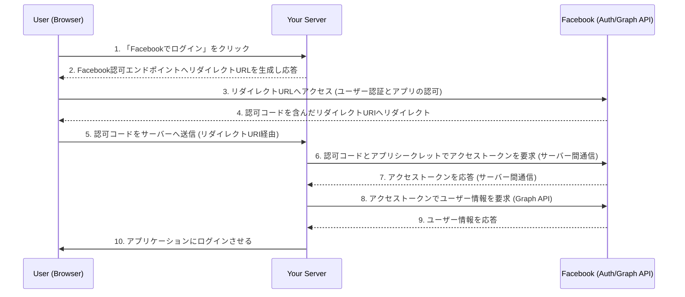

```mermaid
sequenceDiagram
    participant U as User (Browser)
    participant S as Your Server
    participant F as Facebook (Auth/Graph API)

    U->>S: 1. 「Facebookでログイン」をクリック
    S-->>U: 2. Facebook認可エンドポイントへリダイレクトURLを生成し応答
    U->>F: 3. リダイレクトURLへアクセス (ユーザー認証とアプリの認可)
    F-->>U: 4. 認可コードを含んだリダイレクトURIへリダイレクト
    U->>S: 5. 認可コードをサーバーへ送信 (リダイレクトURI経由)
    S->>F: 6. 認可コードとアプリシークレットでアクセストークンを要求 (サーバー間通信)
    F-->>S: 7. アクセストークンを応答 (サーバー間通信)
    S->>F: 8. アクセストークンでユーザー情報を要求 (Graph API)
    F-->>S: 9. ユーザー情報を応答
    S->>U: 10. アプリケーションにログインさせる
```
