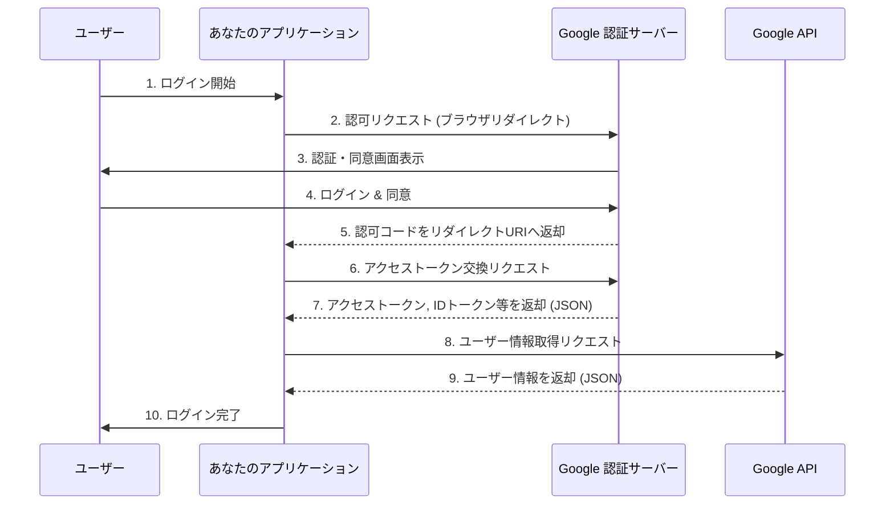
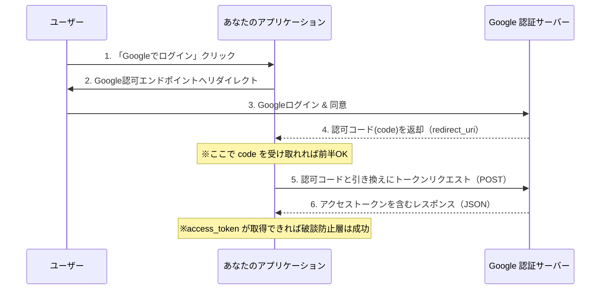

### [ ⏎ 戻る](../index.md)

# Google OAuth 2.0 認証フロー




---

## 認可エンドポイント (Authorization Endpoint)

### URL:
- `https://accounts.google.com/o/oauth2/v2/auth`

### 主な必須クエリパラメーター:

- `client_id`: あなたのアプリケーションのクライアント ID。
- `redirect_uri`: 認可コードが送信されるリダイレクト URI。Google API Console で登録したものと完全に一致する必要あり。
- `response_type`: 取得したいレスポンスのタイプ。認可コードフローでは code を指定。OpenID Connect の場合は code と id_token を組み合わせることもある。
- `scope`: アクセスを要求する情報の範囲を示す文字列。スペース区切りで複数指定できる。

### 正常時のレスポンス:

- `code`: 一時的な認可コード。アクセストークンと交換するために使用。
- `state`: リクエスト時に送信した state パラメーターと同じ値。

---

## トークンエンドポイント (Token Endpoint):

### URL:
- `https://oauth2.googleapis.com/token`

### 主な必須クエリパラメーター(POST リクエストのボディに含める):
- `code`: 認可エンドポイントから取得した認可コード。
- `client_id`: あなたのアプリケーションのクライアント ID。
- `client_secret`: あなたのアプリケーションのクライアントシークレット (ウェブサーバーアプリケーションなど、サーバーサイドで実行されるアプリケーションの場合に必要となってくる)。
- `redirect_uri`: 認可コード取得時と同じリダイレクト URI。
- `grant_type`: authorization_code (認可コードフローの場合)。

### 正常時のレスポンス:
**JSON 形式で以下のデータが返却**
- `access_token`: Google API にアクセスするためのアクセストークン。有効期限あり。
- `expires_in`: アクセストークンの有効期限（秒数）。
- `id_token`: ユーザーの認証情報を含む JSON Web Token (JWT)。sub (ユーザーの一意な識別子)、email、name などの情報が含まれる。OpenID Connect を使用する場合に返される。
- `scope`: 許可されたスコープ。
- `token_type`: 通常は Bearer。
- `refresh_token`: (オフラインアクセスが許可されている場合) アクセストークンの有効期限が切れた際に新しいアクセストークンを取得するためのトークン。


---

## Userinfo エンドポイント (Userinfo Endpoint):

### URL:
- `https://openidconnect.googleapis.com/v1/userinfo`

- より古いエンドポイントも存在するみたい。 `https://www.googleapis.com/oauth2/v3/userinfo` や `https://www.googleapis.com/oauth2/v1/userinfo` 。しかし、OpenID Connect に準拠した上記 URL の使用が推奨されているようです。

### 主な必須クエリパラメーター:

- このエンドポイントへのリクエストは、通常、アクセストークンを Authorization ヘッダーに Bearer トークンとして含めることで行われる。
- クエリパラメーターは通常必要ない。
- HTTP ヘッダー: Authorization: Bearer YOUR_ACCESS_TOKEN

### 正常時のレスポンス:
**JSON 形式でユーザー情報を返却。返される情報の種類は、トークン取得時に要求した scope によって異なる。**

- `sub`: ユーザーの一意な識別子 (ID トークンの sub クレームと同じ値)。
- `name`: ユーザーのフルネーム。
- `given_name`: ユーザーの名。
- `family_name`: ユーザーの姓。
- `picture`: ユーザーのプロフィール画像の URL。
- `email`: ユーザーのメールアドレス。
- `email_verified`: メールアドレスが確認済みかどうか (boolean)。
- `locale`: ユーザーの言語/地域。
- `hd`: (Hosted Domain) Google Workspace (旧 G Suite) ドメインユーザーの場合、そのドメイン名。 

---

# 破断防止層での OAuth 実装


### 破断防止層を導入することで、アプリケーションのコアロジックは外部サービスの具体的な実装詳細から切り離され、保守性や拡張性が向上します。

- 特徴：
  - 標準的なOAuth 2.0の認可コードフローに準拠

- ACLの役割：
  - 認可コードの受け取りとアクセストークン（およびIDトークン、リフレッシュトークン）の交換をサーバーサイドで行う。
  - client_secretはサーバーサイドで安全に管理
  - IDトークンが提供されるため、その署名検証とデコードを行い、ユーザー情報を抽出
  - Google固有のAPI（例: People API）を呼び出してユーザー詳細情報を取得し、内部システムが利用しやすい形式に変換

- ポイント：
  - IDトークンの検証はACLの重要な役割

---

## ACLから情報を取得する固有のアクセストークン集約リポジトリアダプターという観点でOAuthエンドポイントと関連情報を整理

**この「アクセストークン集約リポジトリアダプター」は、ACLのバックエンド側コンポーネントであり、内部システムが「Googleのアクセストークンが欲しい」と要求した際に、OAuthフローを完了させ、必要なトークンを安全に取得・管理し、抽象化された形で提供する役割を担う**

### Google OAuthエンドポイントとACLアダプターの整理

## エンドポイント
  - Google OAuth 2.0の主要なエンドポイントは以下の通り。ACLはこのエンドポイントと直接通信する。
　　
- **認可エンドポイント (Authorization Endpoint)**: ユーザーを認証し、認可を得るためのエンドポイント。

URL: `https://accounts.google.com/o/oauth2/v2/auth`

- **トークンエンドポイント (Token Endpoint)**: 認可コードをアクセストークンやIDトークンに交換するためのエンドポイント。

URL: `https://oauth2.googleapis.com/token`

- **トークン情報エンドポイント (Token Info Endpoint - オプション)**: アクセストークンの有効性を検証し、その情報を取得するためのエンドポイント。ACLが取得したアクセストークンを検証する際に利用できます。

URL: `https://www.googleapis.com/oauth2/v3/tokeninfo`

- **ユーザー情報エンドポイント (Userinfo Endpoint - オプション)**: アクセストークンを用いてユーザーのプロファイル情報を取得するためのエンドポイント。

URL: `https://www.googleapis.com/oauth2/v3/userinfo` または `https://openidconnect.googleapis.com/v1/userinfo` (OpenID Connect使用時)


## 主なクエリパラメータ
**ACLがGoogleと通信する際に使用する主要なパラメータ**

- **認可リクエスト (Authorization Request) - ClientApp からユーザーをリダイレクトする際に使用**

- `client_id`: アプリケーションのクライアントID。必須。
- `redirect_uri`: 認可コードが返されるリダイレクトURI。Google Cloud Consoleで事前に登録したものと一致させる必要があります。必須。
- `response_type`: code を指定します。認可コードフローを示します。必須。
- `scope`: 要求するアクセス権限の範囲。例: openid profile email。スペース区切りで複数指定可能。必須。
- `access_type`: offline を指定するとリフレッシュトークンが発行されます。通常はofflineを指定してリフレッシュトークンを取得します。
- `state`: CSRF攻撃を防ぐための任意の文字列。リダイレクトURI経由でそのまま返されます。

- **トークンリクエスト (Token Request) - ClientApp (ACL) がGoogleのトークンエンドポイントへPOSTする際に使用**

- `client_id`: アプリケーションのクライアントID。必須。
- `client_secret`: アプリケーションのクライアントシークレット。必須（Confidential Clientの場合）
- `code`: 認可エンドポイントから返された認可コード。必須。
- `redirect_uri`: 認可リクエスト時と同じリダイレクトURI。必須。
- `grant_type`: authorization_code を指定します。認可コードフローのトークン交換を示します。必須。


## レスポンス (正常時)

- **認可リクエスト後のリダイレクト (redirect_uri へのクエリパラメータ)**

- code: 認可コード。
- state: 認可リクエスト時に送ったstateパラメータの値（CSRF対策）。

- **トークンリクエスト後のレスポンス (JSON)**
- ACLが最終的に取得する重要な情報

- `access_token`: APIリクエストに使用するアクセストークン。
- `expires_in`: アクセストークンの有効期限（秒）。
- `scope`: 許可されたスコープ。
- `token_type`: トークンのタイプ（通常はBearer）。
- `id_token`: IDトークン。JWT (JSON Web Token) 形式で、ユーザーの識別情報と認証情報が含まれます。ACLはこの署名を検証し、デコードしてユーザー情報を抽出。
- `refresh_token`: アクセストークンが期限切れになった際に、新しいアクセストークンを取得するために使用するトークン。ACLはこのトークンを安全に永続化し、期限切れ時の自動更新ロジックを実装すべき。

## APIクエリパラメータのマッピング
**これは、ACLがGoogle APIを呼び出す際に、内部システムからの抽象的なリクエストをGoogle APIの具体的なパラメータにマッピングする方法**

- **内部リクエスト: getUserProfile(internalUserId)**
- ACLでの変換例 (Googleの場合):
  - internalUserId に対応するGoogleのaccess_tokenをACLの内部ストアから取得。
  - Google Userinfo Endpoint (`https://www.googleapis.com/oauth2/v3/userinfo`) に対して、HTTPヘッダーに Authorization: Bearer <access_token> を付与してリクエスト。
  - 特定の情報が必要な場合、scopeに含めておく（例: profile, email）。

## APIレスポンスと集約のマッピング
**これは、ACLがGoogle APIから受け取ったレスポンスを、内部システムが利用する汎用的なデータ構造に変換・集約する部分**

- Google Userinfo Endpointのレスポンス例:
```json
{
  "sub": "123456789012345678901",
  "name": "John Doe",
  "given_name": "John",
  "family_name": "Doe",
  "picture": "https://lh3.googleusercontent.com/a/...",
  "email": "john.doe@example.com",
  "email_verified": true,
  "locale": "en"
}
```

- ACLでの変換・集約例 (内部システム向けの汎用ユーザー情報オブジェクト):
```php
class InternalUser {
    public string $id;
    public string $displayName;
    public string $email;
    public ?string $profilePictureUrl = null;
    public bool $emailVerified;
    public array $providerSpecificData; // 必要であれば、元のデータを格納
}

// マッピングロジック
$googleResponse = /* Google APIからのJSONレスポンス */;
$internalUser = new InternalUser();
$internalUser->id = $googleResponse['sub']; // Googleのsubを内部IDにマッピング
$internalUser->displayName = $googleResponse['name'];
$internalUser->email = $googleResponse['email'];
$internalUser->profilePictureUrl = $googleResponse['picture'] ?? null;
$internalUser->emailVerified = $googleResponse['email_verified'] ?? false;
$internalUser->providerSpecificData = $googleResponse; // 生データを保存

return $internalUser;
```

- ポイント: 
  - ACLは、Google固有のsubやpictureといったキー名を、内部システムで一貫して使用するidやprofilePictureUrlといったキー名に変換します。
  - これにより、内部システムはGoogleだけでなく、他のOAuthプロバイダーから取得した情報も同じInternalUserオブジェクトとして扱えるようになります。


#### ACLは、これら全てのGoogle固有のプロトコルやAPI詳細をカプセル化し、内部システムには抽象化されたInternalUserオブジェクトやセッション情報のみを渡す役割を担う。

---

## 参考資料

- Google Identity の認証に関するドキュメント: 
  - [`https://developers.google.com/identity/protocols/oauth2?hl=ja`](https://developers.google.com/identity/protocols/oauth2?hl=ja)  
  

- OpenID Connectの中核機能 & エンドユーザーに関する情報を伝達するためのクレームの使用を定義し、OpenID Connectの使用におけるセキュリティとプライバシーに関する考慮事項についてを説明した仕様書: 
  - [`https://openid.net/specs/openid-connect-core-1_0.html`](https://openid.net/specs/openid-connect-core-1_0.html)

### [ ⏎ 戻る](../index.md)
