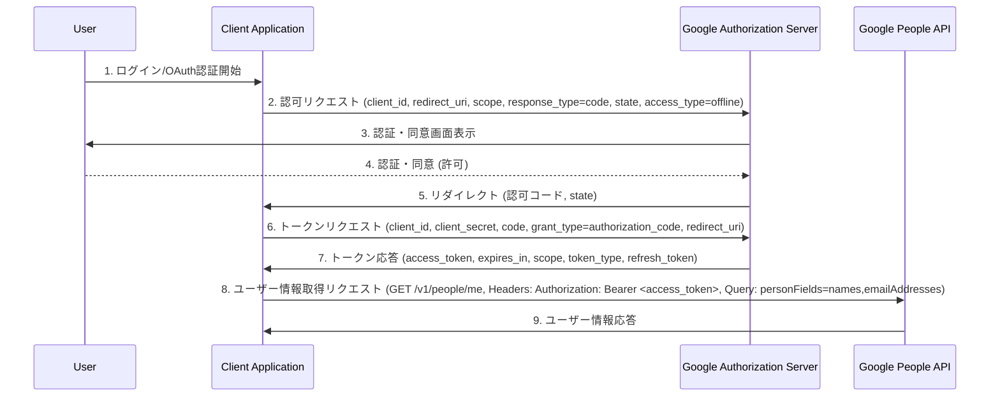

# Google OAuth認証とユーザー情報取得

## OAuth認証フロー
- **GoogleのOAuth 2.0認証フローは、主にウェブサーバーアプリケーションで利用される認可コードグラントタイプに基づいています。**


```mermaid
sequenceDiagram
    participant User
    participant ClientApp as Client Application
    participant GoogleAuth as Google Authorization Server
    participant GoogleAPI as Google People API

    User->>ClientApp: 1. ログイン/OAuth認証開始
    ClientApp->>GoogleAuth: 2. 認可リクエスト (client_id, redirect_uri, scope, response_type=code, state, access_type=offline)
    GoogleAuth->>User: 3. 認証・同意画面表示
    User-->>GoogleAuth: 4. 認証・同意 (許可)
    GoogleAuth->>ClientApp: 5. リダイレクト (認可コード, state)
    ClientApp->>GoogleAuth: 6. トークンリクエスト (client_id, client_secret, code, grant_type=authorization_code, redirect_uri)
    GoogleAuth->>ClientApp: 7. トークン応答 (access_token, expires_in, scope, token_type, refresh_token)
    ClientApp->>GoogleAPI: 8. ユーザー情報取得リクエスト (GET /v1/people/me, Headers: Authorization: Bearer <access_token>, Query: personFields=names,emailAddresses)
    GoogleAPI->>ClientApp: 9. ユーザー情報応答
```

## エンドポイントと主なクエリパラメータ

- 認可エンドポイント
  - URL: https://accounts.google.com/o/oauth2/v2/auth
  - HTTPメソッド: GET
  - 主な必須クエリパラメータ:
    - client_id: アプリケーションのクライアントID。
    - redirect_uri: 認証後にユーザーがリダイレクトされるアプリケーションのURL。(Google API Consoleで設定したものと完全に一致する必要があります。)
    - response_type: code (認可コードフローの場合)。
    - scope: アプリケーションがアクセスを必要とするGoogle APIのスコープをスペース区切りで指定
    - state: (推奨) クロスサイトリクエストフォージェリ (CSRF) 攻撃を防ぐための任意の文字列。リダイレクトURI経由で返されます。
    - access_type: offline を指定すると、refresh_token が発行され、ユーザーがオフラインでも新しいアクセストークンを取得できるようになります。
- トークンエンドポイント
  - URL: https://oauth2.googleapis.com/token
  - HTTPメソッド: POST
  - 主な必須リクエストボディパラメータ (application/x-www-form-urlencoded):
    - client_id: アプリケーションのクライアントID。
    - client_secret: アプリケーションのクライアントシークレット。
    - code: 認可エンドポイントから取得した認可コード。
    - grant_type: authorization_code (認可コードを交換する場合) または refresh_token (リフレッシュトークンで新しいアクセストークンを取得する場合)。
    - redirect_uri: 認可エンドポイントで使用したものと同じリダイレクトURI。

## レスポンス（正常時）
- トークンエンドポイントへのリクエストが成功すると、以下の情報を含むJSON形式のレスポンスが返されます。
```json
{
  "access_token": "ya29.a0AdeX...",
  "expires_in": 3599,
  "scope": "https://www.googleapis.com/auth/userinfo.profile https://www.googleapis.com/auth/userinfo.email",
  "token_type": "Bearer",
  "refresh_token": "1//0geE..."
}
```
- access_token: Google APIにアクセスするために使用するトークン。
- expires_in: アクセストークンの有効期間（秒単位）。通常は1時間（3600秒）程度ですが、異なる場合があります。
- scope: ユーザーがアプリケーションに許可した権限の範囲。
- token_type: トークンの種類。Google APIでは通常 Bearer です。
- refresh_token: 長期間有効なトークンで、アクセストークンが期限切れになった際に新しいアクセストークンを取得するために使用されます。初期の認可リクエストで access_type=offline を指定した場合にのみ返されます。

## ユーザー情報取得APIエンドポイントと仕様概要

- ユーザーのプロファイル情報（名前、メールアドレスなど）は、主にGoogle People APIを使用して取得します。

- APIエンドポイント
  - API: Google People API
  - エンドポイント: https://people.googleapis.com/v1/people/me
  - HTTPメソッド: GET
  - ヘッダー: Authorization: Bearer <access_token>
  - クエリパラメータ:
    - personFields: 取得したいユーザー情報のフィールドをカンマ区切りで指定

- 取得可能なユーザー情報フィールドと必要なスコープ

| フィールド名（personFieldsで指定） | 	概要                      | 	必要なスコープ（例）                                                   |
|-------------------------|--------------------------|---------------------------------------------------------------|
| names                   | 	ユーザーの名前情報（表示名、姓、名など）    | 	https://www.googleapis.com/auth/userinfo.profile または profile |
|emailAddresses| 	ユーザーのメールアドレス情報（プライマリなど） | 	https://www.googleapis.com/auth/userinfo.email または email     |
|photos	| ユーザーのプロフィール写真のURL        | 	https://www.googleapis.com/auth/userinfo.profile または profile |
|birthdays| 	ユーザーの誕生日                | 	https://www.googleapis.com/auth/userinfo.profile または profile |
|genders| 	ユーザーの性別                 | 	https://www.googleapis.com/auth/userinfo.profile または profile |
|locales| 	ユーザーの言語/ロケール            | 	https://www.googleapis.com/auth/userinfo.profile または profile |
...（その他多数）		

## レスポンス例 (正常時)

```json
{
  "resourceName": "people/xxxxxxxxxxxxxxxxx",
  "etag": "...",
  "names": [
    {
      "metadata": {
        "primary": true,
        "source": {
          "type": "PROFILE",
          "id": "xxxxxxxxxxxxxxxxx"
        }
      },
      "displayName": "Test User",
      "familyName": "User",
      "givenName": "Test",
      "displayNameLastFirst": "User, Test",
      "unstructuredName": "Test User"
    }
  ],
  "emailAddresses": [
    {
      "metadata": {
        "primary": true,
        "verified": true,
        "source": {
          "type": "ACCOUNT",
          "id": "xxxxxxxxxxxxxxxxx"
        }
      },
      "value": "test.user@gmail.com"
    }
  ]
}
```

## アクセストークンとリフレッシュトークン
- アクセストークン: 短期間（通常1時間）有効で、APIリクエストの認証に使用されます。
- リフレッシュトークン: 長期間有効で、アクセストークンが期限切れになった際に、ユーザーの再認証なしに新しいアクセストークンを取得するために使用されます。access_type=offline を指定した場合にのみ発行されます。リフレッシュトークンは、ユーザーがアクセスを取り消すか、長期間使用されない（6ヶ月以上）などの特定の条件下で失効します。

## エラーハンドリング
- OAuthフローおよびAPI呼び出し中に発生する可能性のある一般的なエラーには、以下のようなものがあります。
  - invalid_request: リクエストの形式が不正、必須パラメータの欠如など。
  - invalid_client: クライアント認証の失敗。
  - invalid_grant: 認可コードまたはリフレッシュトークンが無効または期限切れ。
  - redirect_uri_mismatch: リダイレクトURIが登録済みのものと一致しない。
  - unauthorized_client: クライアントが認可グラントタイプを使用する権限がない。
  - access_denied: ユーザーがアクセスを拒否した。
  - insufficient_scope: アクセストークンにAPI呼び出しに必要なスコープが含まれていない。  

**⚠︎ 詳細なエラーコードと対応については、Googleの公式ドキュメントを参照**

---

## [OAuth認証におけるエンドポイント、主なクエリパラメーター、およびレスポンスを確認できる公式ドキュメントへ ☞](https://developers.google.com/identity/protocols/oauth2/web-server)
