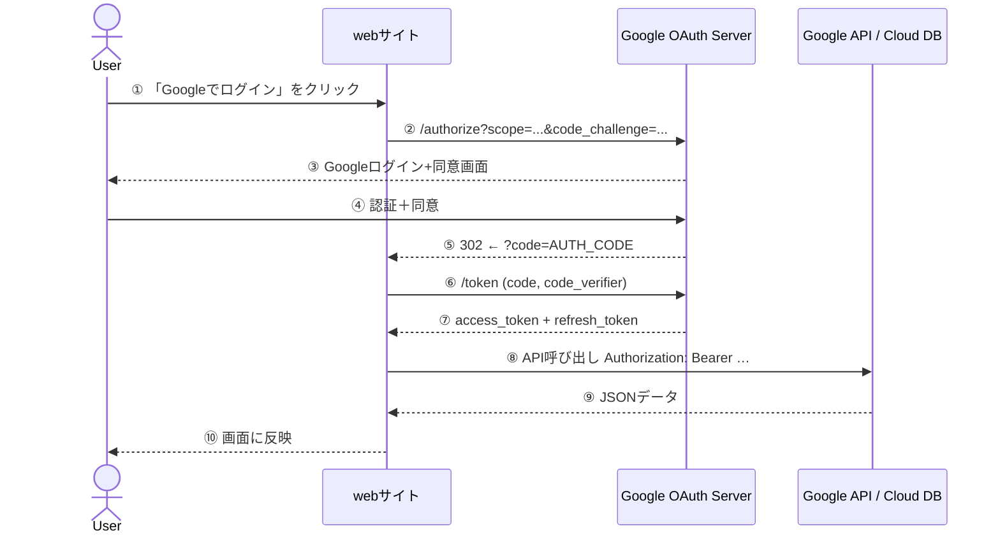

### [ ⏎ 戻る](../index.md)
# Google OAuth認証とユーザー情報取得

## OAuth認証フロー
- **GoogleのOAuth 2.0認証フローは、主にウェブサーバーアプリケーションで利用される認可コードグラントタイプに基づいています。**


```mermaid
sequenceDiagram
  actor User
  participant Site as webサイト
  participant GoogleAuth as Google OAuth Server
  participant GAPI as Google API / Cloud DB

  User->>Site: ① 「Googleでログイン」をクリック
  Site->>GoogleAuth: ② /authorize?scope=...&code_challenge=...
  GoogleAuth-->>User: ③ Googleログイン+同意画面
  User->>GoogleAuth: ④ 認証＋同意
  GoogleAuth-->>Site: ⑤ 302 ← ?code=AUTH_CODE
  Site->>GoogleAuth: ⑥ /token (code, code_verifier)
  GoogleAuth-->>Site: ⑦ access_token + refresh_token
  Site->>GAPI: ⑧ API呼び出し Authorization: Bearer …
  GAPI-->>Site: ⑨ JSONデータ
  Site-->>User: ⑩ 画面に反映


```
---
### ログインしているユーザーIDを安全に取得するための、最も推奨される、そして最終的に最も確実なステップ

#### [ユーザーID取得方法へ](../allowed-code-flows/google_user_id.md)

---
### webサイトからサーバーに向けて打つAPIの回数

- 回数：3 回

### それぞれのAPIのエンドポイントと正常時のレスポンス

---
## ・ GET https://accounts.google.com/o/oauth2/v2/auth

### 用途：
- ユーザーを Google の 認可画面 にリダイレクトするためのエンドポイント
- 認証と同意を得て、認可コード を取得する

### 必要なパラメータ（URLクエリ）

| 要素                           | 説明                                    |
| ---------------------------- | ------------------------------------- |
| `client_id`                  | Google Cloud Console で発行されたアプリ識別子。    |
| `redirect_uri`               | 認可コードを送り返すコールバック URL（事前登録必須）。         |
| `response_type=code`         | 「認可コードフロー」を使うことを示す固定値。                |
| `scope`                      | 要求する権限セット（`openid email profile` など）。 |
| `state`                      | CSRF 攻撃を防ぐランダム文字列。                    |
| `code_challenge`             | PKCE 用のハッシュ化値（公開クライアントで必須）。           |
| `code_challenge_method=S256` | `code_challenge` の生成アルゴリズム（S256 推奨）。  |


### 認可エンドポイントからの リダイレクト／POST レスポンス(/o/oauth2/v2/auth)
- ステータス：HTTP/1.1 302 Found
- Location ヘッダー：
```text
Location: https://your.site/callback?
          code=AUTH_CODE&
          state=ORIGINAL_STATE
```
- 送信方式：クライアント（ブラウザ）が自動 GET リダイレクト
- 返却パラメータ：
  - code：認可コード。次段の /token で使用
  - state：送信時と同一文字列。必ず照合し CSRF を防ぐ
- エラー時：
```text
Location: https://your.site/callback?
          error=access_denied&
          error_description=User+denied+
          the+request&
          state=...
```


---
## ・ POST https://oauth2.googleapis.com/token

### 用途：
- 認可コードから アクセストークン・IDトークン・リフレッシュトークン を取得

### 必要なパラメータ（POST body, application/x-www-form-urlencoded）

| 要素              | 説明                                      |
| --------------- | --------------------------------------- |
| `access_token`  | API 呼び出し時に `Bearer` で送る短命トークン。          |
| `expires_in`    | `access_token` の有効期間（秒単位）。              |
| `refresh_token` | ユーザー再同意なしで新しい `access_token` を得る長命トークン。 |
| `scope`         | 付与されたスコープ一覧（空なら要求通り）。                   |
| `token_type`    | 通常 `"Bearer"` 固定。                       |
| `id_token`      | JWT 形式のユーザーアイデンティティ（OpenID Connect）。    |


### レスポンス（JSON）
```json
{
  "access_token": "...",         // 認証APIに使う
  "expires_in": 3599,            // 秒数（例：1時間）
  "refresh_token": "...",        // オフラインアクセス用（初回のみ）
  "scope": "openid email profile",
  "token_type": "Bearer",
  "id_token": "..."              // JWT、ユーザー情報含む
}
```

---
## ・ GET https://www.googleapis.com/oauth2/v3/userinfo

### 用途：
- access_token を用いて ユーザー情報 を取得（id_token を使わず明示的に fetch）

### 必要な要素（HTTPヘッダー）
- Authorization: Bearer {access_token}

### レスポンス（JSON）

| 要素                                    | 説明                     |
| ------------------------------------- | ---------------------- |
| `sub`                                 | Google が発行する一意ユーザー ID。 |
| `name` / `given_name` / `family_name` | フルネーム・名・姓。             |
| `email` / `email_verified`            | メールアドレスと検証済みフラグ。       |
| `picture`                             | プロフィール画像 URL。          |
| `locale`                              | ユーザーのロケール文字列。          |


#### 補足：
- id_token は JWT（署名付きトークン）、クライアントサイドで即デコード可
- userinfo は REST API による明示的な取得
- 基本的には内容が一致するが、userinfo は常に最新版を返すため再検証用にも使われる

### [ ⏎ 戻る](../index.md)
