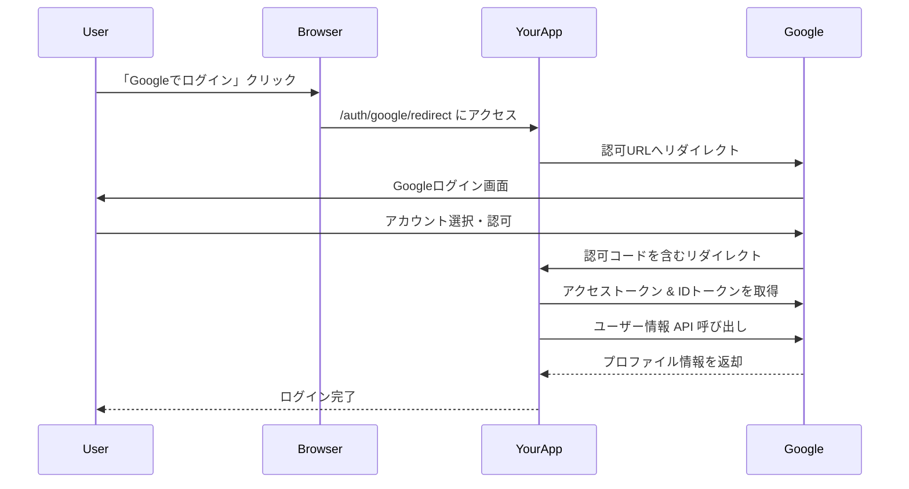

# Google OAuth 2.0 + OIDC の仕様と実装ポイント

## 🔍 概要

- Google の OAuth 2.0 認証は、OpenID Connect (OIDC) に準拠しており、安全かつ柔軟なログイン機構を提供します。
- Laravelでは Socialite を使うことで簡単に統合可能です。

---
- エンドポイント
```bash
GET https://www.googleapis.com/oauth2/v3/userinfo
```
- 主なクエリパラメーター（すべて必須）

| パラメーター          | 内容                                              |
| --------------- | ----------------------------------------------- |
| `Authorization` | `Bearer {access_token}`（ログインユーザーから取得したアクセストークン） |

- レスポンス（正常時）
```json
{
"sub": "110169484474386276334",
"name": "山田 太郎",
"given_name": "太郎",
"family_name": "山田",
"picture": "https://lh3.googleusercontent.com/a/abc123",
"email": "example@gmail.com",
"email_verified": true,
"locale": "ja"
}
```
- フィールド一覧

| フィールド名           | 内容                            |
| ---------------- | ----------------------------- |
| `sub`            | Google 側で一意のユーザー ID           |
| `name`           | フルネーム                         |
| `given_name`     | 名                             |
| `family_name`    | 姓                             |
| `picture`        | プロフィール画像 URL                  |
| `email`          | メールアドレス                       |
| `email_verified` | メールが認証済みかどうか (`true`/`false`) |
| `locale`         | ロケール（例: `ja`）                 |


---

## ✅ 認証フロー概要（OIDC対応）


```mermaid
sequenceDiagram
    participant User
    participant Browser
    participant YourApp
    participant Google

    User->>Browser: 「Googleでログイン」クリック
    Browser->>YourApp: /auth/google/redirect にアクセス
    YourApp->>Google: 認可URLへリダイレクト
    Google->>User: Googleログイン画面
    User->>Google: アカウント選択・認可
    Google->>YourApp: 認可コードを含むリダイレクト
    YourApp->>Google: アクセストークン & IDトークンを取得
    YourApp->>Google: ユーザー情報 API 呼び出し
    Google-->>YourApp: プロファイル情報を返却
    YourApp-->>User: ログイン完了
```

## ⚙️ エンドポイント一覧

| 種別             | エンドポイント                                                        |
| -------------- | -------------------------------------------------------------- |
| 認可リクエスト        | `https://accounts.google.com/o/oauth2/v2/auth`                 |
| トークン取得         | `https://oauth2.googleapis.com/token`                          |
| ユーザー情報取得       | `https://www.googleapis.com/oauth2/v3/userinfo`                |
| OIDC Discovery | `https://accounts.google.com/.well-known/openid-configuration` |

## 🛠 必要スコープ
```text
openid email profile
```
- openid は OIDC の必須スコープ
- email や profile を使うことで、メールや名前、アイコンなどを取得

## 📄 ID Token (JWT)

- Google OAuth 2.0 では access_token に加えて ID token (JWT) が付与されます。
```text
{
  "iss": "https://accounts.google.com",
  "sub": "110169484474386276334",
  "email": "example@gmail.com",
  "email_verified": true,
  "name": "界塚 伊奈帆",
  "picture": "https://lh3.googleusercontent.com/a/abc123",
  ...
}
```
- sub: Google側で一意のユーザーID
- iss: 発行元
- email_verified: メール認証状態

## ⚠️ 評価・注意点
- redirect_uriは Google Developer Console に登録したものと完全に一致すること
- state は CSRF 対策のため必ず利用
- email_verified を確認することで成りすまし防止
- ゲストユーザーの情報は ID Token に含まれない場合もあるので userinfo API と一緒に利用する

## 🔹 まとめ
- Google OAuth 2.0 は OIDC 対応で安全で操作も簡単
- ID Token は JWT形式で利用可能
- userinfo API や scope の利用により、詳細な情報を取得
- Laravel Socialite での実装例は [google.ts](../auth-flow-examples/google.ts) を参照
