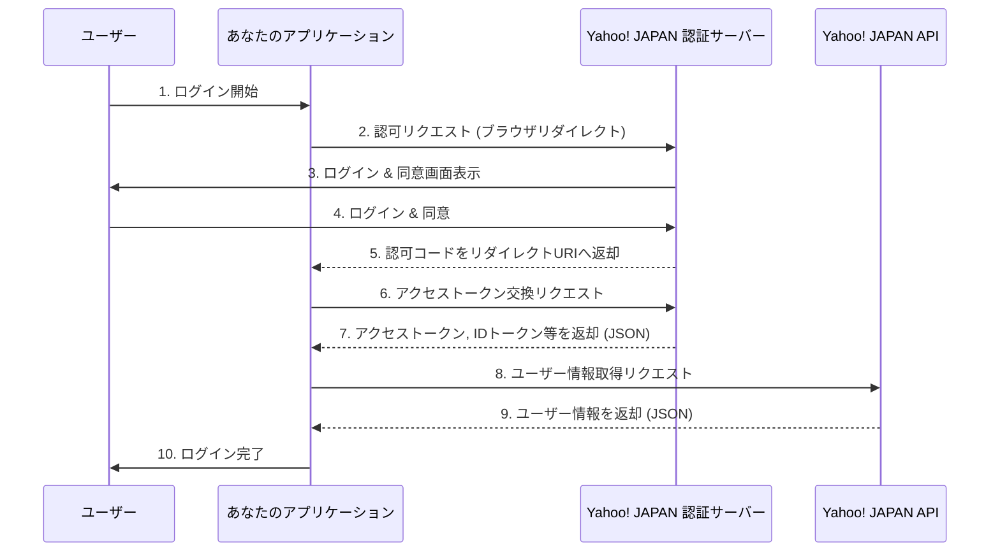
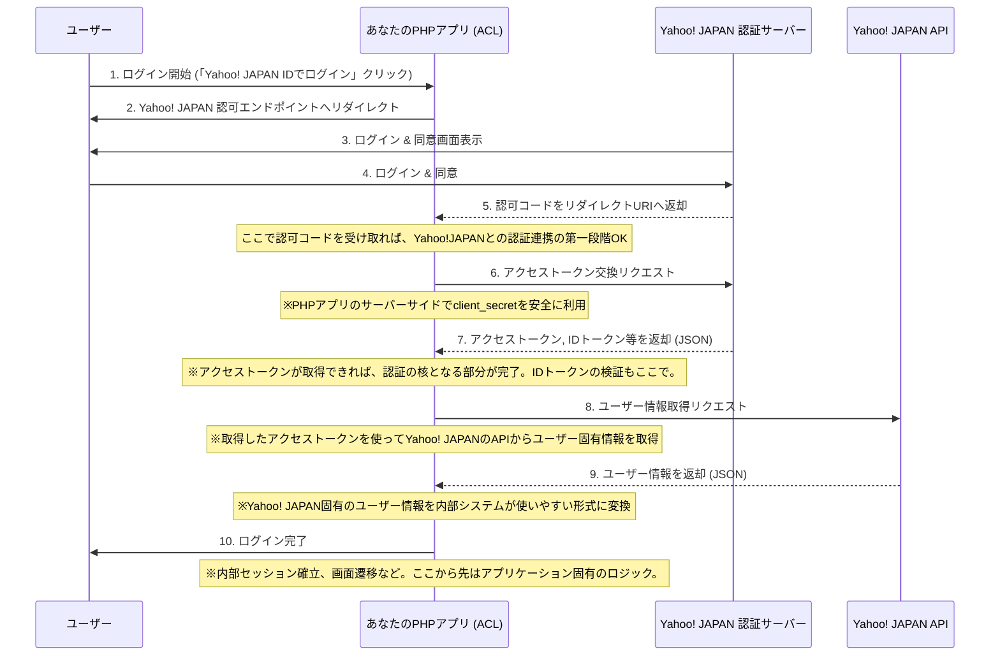

### [ ⏎ 戻る](../index.md)
  

#  Yahoo! JAPAN OAuth 2.0 認証フロー
**Yahoo! JAPANのOAuth 2.0実装は、基本的にはRFC 6749に準拠した標準的な認可コードフローです。**  
**Appleのような、トークン交換を厳格にバックエンドで行うことを強く推奨する方式とは異なり、client_secret を安全に管理できる環境であれば、バックエンドでトークン交換を行うのが一般的**

- **Yahoo! JAPAN の OAuth 2.0 認証フローは、OpenID Connect (OIDC) に準拠しており、「Yahoo! ID連携 v2」として提供されています。公式ドキュメントは「Yahoo!デベロッパーネットワーク」にあります。**

---

## Discovery エンドポイント (OpenID Configuration エンドポイント)
**Yahoo! JAPAN の OpenID Connect では、まずこのエンドポイントにアクセスして、他のエンドポイントの URL やサポートされている機能（response_type や scope など）を確認することが推奨されています。**

### URL:
- `https://auth.login.yahoo.co.jp/yconnect/v2/.well-known/openid-configuration`

### 主な必須クエリパラメーター:

- なし
  

- **参考ページ ☞**:
  - Authorization Codeフロー - Yahoo!デベロッパーネットワーク: [`https://developer.yahoo.co.jp/yconnect/v2/authorization_code/`](https://developer.yahoo.co.jp/yconnect/v2/authorization_code/)
  - OpenID Configurationエンドポイント: [`https://developer.yahoo.co.jp/yconnect/v2/authorization_code/configuration.html`](https://developer.yahoo.co.jp/yconnect/v2/authorization_code/configuration.html)

### 正常時のレスポンス:
**JSON 形式で各エンドポイントの URL やサポートされる機能が返されます。**

- `issuer`: Claimsの発行者 (`https://auth.login.yahoo.co.jp/yconnect/v2`)
- `authorization_endpoint`: 認可エンドポイントのURL
- `token_endpoint`: トークンエンドポイントのURL
- `userinfo_endpoint`: UserInfoエンドポイントのURL
- `jwks_uri`: JSON Web Key Set のURL
- `response_types_supported`: サポートする response_type のリスト
- `scopes_supported`: サポートする scope のリスト
- その他、様々な OpenID Connect 関連の情報

---

## 認可エンドポイント (Authorization Endpoint)

**ユーザーが Yahoo! JAPAN ID でログインし、あなたのアプリケーションに情報へのアクセスを許可するためのエンドポイントです。**

### URL:

- `https://auth.login.yahoo.co.jp/yconnect/v2/authorization`

### 主な必須クエリパラメーター:

- `response_type`: 取得したいレスポンスのタイプ。認可コードフローでは code を指定します。OpenID Connect を利用する場合は code%20id_token や code%20token%20id_token など、スペース区切りで指定します。
- `client_id`: アプリケーション登録時に発行された Client ID。
- `redirect_uri`: 認可コードが送信されるリダイレクト URI。Yahoo! JAPAN デベロッパーネットワークで登録したものと完全に一致する必要があります。
- `scope`: 要求するユーザー情報の範囲を示す文字列。スペース区切りで複数指定します。
- `openid`: (必須) OpenID Connect を使用することを示し、ユーザー識別子を返却します。
- `profile`: 姓名、生年、性別などを返却します。
- `email`: メールアドレスと確認済みフラグを返却します。
- `address`: ユーザー登録住所情報を返却します。
- `state`: CSRF 対策として必須。リクエストごとにアプリケーション側で生成した十分な長さのランダムな文字列。レスポンスで返される state と比較して検証します。
- `nonce`: (OpenID Connect の場合、推奨) リプレイアタック対策として必須。リクエストごとにアプリケーション側で生成したランダムな文字列。ID Token に含まれて返却され、検証が必要です。
  

- **参考ページ ☞**: Authorizationエンドポイント: [`https://developer.yahoo.co.jp/yconnect/v2/hybrid/authorization.html`](https://developer.yahoo.co.jp/yconnect/v2/hybrid/authorization.html)

### 正常時のレスポンス:

**ユーザーが許可すると、redirect_uri にリダイレクトされ、URL のクエリパラメーターとして以下の情報を含みます。**

- `code`: 認可コード。トークンと交換するために使用します。
- `id_token`: (要求された場合) ユーザーの認証情報を含む JWT。
- `state`: リクエスト時に送信した state パラメーターと同じ値。

---

## トークンエンドポイント (Token Endpoint)

**認可コードをアクセストークンや ID トークンに交換するためのエンドポイント**

### URL:

- `https://auth.login.yahoo.co.jp/yconnect/v2/token`

### 主な必須クエリパラメーター (POST リクエストのボディに application/x-www-form-urlencoded または application/json 形式で含める):

- `grant_type`: authorization_code (認可コードをアクセストークンと交換する場合) または refresh_token (リフレッシュトークンを使用してアクセストークンを更新する場合)。
- `code`: (grant_type が authorization_code の場合) 認可エンドポイントから取得した認可コード。
- `redirect_uri`: 認可エンドポイントで使用したリダイレクト URI と同じもの。
- `client_id`: あなたの Client ID。
- `client_secret`: あなたの Client Secret。
  

- **参考ページ ☞**: Tokenエンドポイント: [`https://developer.yahoo.co.jp/yconnect/v2/authorization_code/token.html`](https://developer.yahoo.co.jp/yconnect/v2/authorization_code/token.html)

### 正常時のレスポンス:

**JSON 形式で以下のデータが返されます**

- `access_token`: Yahoo! JAPAN API にアクセスするためのアクセストークン。
- `token_type`: 通常は Bearer。
- `expires_in`: アクセストークンの有効期限（秒）。
- `id_token`: ユーザーの認証情報を含む JWT (JSON Web Token)。
- `sub`: Yahoo! JAPAN ID 全体で一意のユーザー識別子。
- `email`: ユーザーのメールアドレス。
- `email_verified`: メールアドレスが確認済みかどうか (boolean)。
- `name`: ユーザーの氏名。
- その他、要求された scope に応じたクレーム。
- `refresh_token`: (初回認証時やオフラインアクセスが許可されている場合) アクセストークンの有効期限が切れた際に新しいアクセストークンを取得するためのトークン。

---

## Userinfo エンドポイント (属性情報取得API)

**アクセストークンを使用して、ユーザーの属性情報（プロフィール、メールアドレスなど）を取得するためのエンドポイントです。**

### URL:

- `https://userinfo.yahooapis.jp/yconnect/v2/attribute`

### 主な必須クエリパラメーター:

- なし
  - HTTP ヘッダー: Authorization: Bearer YOUR_ACCESS_TOKEN を付与してリクエストします。
  

- **参考ページ ☞**: 属性取得API（UserInfoAPI）: [`https://developer.yahoo.co.jp/yconnect/v2/userinfo.html`](https://developer.yahoo.co.jp/yconnect/v2/userinfo.html)

### 正常時のレスポンス:

**JSON 形式でユーザー情報が返されます。返されるデータは、トークン取得時に指定した scope によって異なります。**

- `sub`: Yahoo! JAPAN ID 全体で一意のユーザー識別子。
- `name`: ユーザーの氏名。
- `given_name`: ユーザーの名。
- `family_name`: ユーザーの姓。
- `email`: ユーザーのメールアドレス。
- `email_verified`: メールアドレスが確認済みかどうか。
- `gender`: 性別。
- `birthdate`: 生年月日。
- `address`: 住所情報。
- `locale`: 言語。
- その他、要求されたスコープに応じた属性情報。

---

# 破談防止層の視点から

### 破断防止層を導入することで、アプリケーションのコアロジックは外部サービスの具体的な実装詳細から切り離され、保守性や拡張性が向上します。

- 特徴：
  - 標準的なOAuth 2.0の認可コードフローに準拠

- ACLの役割：
  - 認可コードの受け取りとアクセストークン交換をサーバーサイドで行う
  - client_secretはサーバーサイドで安全に管理
  - Yahoo! JAPANのユーザー情報APIを呼び出し、ユーザー情報を取得
  - Yahoo! JAPAN固有のユーザー情報を、内部システムが利用しやすい形式に変換

- ポイント：
  -  GoogleやFacebookと非常に類似しており、標準的なOAuthフローにおけるACLの役割を担う

---

## ACLから情報を取得する固有のアクセストークン集約リポジトリアダプターという観点でOAuthエンドポイントと関連情報を整理

---

# 参考資料まとめ

- Yahoo! ID連携 v2 公式ドキュメントトップ: [`https://developer.yahoo.co.jp/yconnect/v2/`](https://developer.yahoo.co.jp/yconnect/v2/)  
  

- Authorization Codeフロー - Yahoo!デベロッパーネットワーク: [`https://developer.yahoo.co.jp/yconnect/v2/authorization_code/`](https://developer.yahoo.co.jp/yconnect/v2/authorization_code/)
  

- OpenID Configurationエンドポイント: [`https://developer.yahoo.co.jp/yconnect/v2/authorization_code/configuration.html`](https://developer.yahoo.co.jp/yconnect/v2/authorization_code/configuration.html)
  

- Authorizationエンドポイント: [`https://developer.yahoo.co.jp/yconnect/v2/hybrid/authorization.html`](https://developer.yahoo.co.jp/yconnect/v2/hybrid/authorization.html)
  

- Tokenエンドポイント: [`https://developer.yahoo.co.jp/yconnect/v2/authorization_code/token.html`](https://developer.yahoo.co.jp/yconnect/v2/authorization_code/token.html)
  

- 属性取得API（UserInfoAPI）: [`https://developer.yahoo.co.jp/yconnect/v2/userinfo.html`](https://developer.yahoo.co.jp/yconnect/v2/userinfo.html)

### [ ⏎ 戻る](../index.md)
