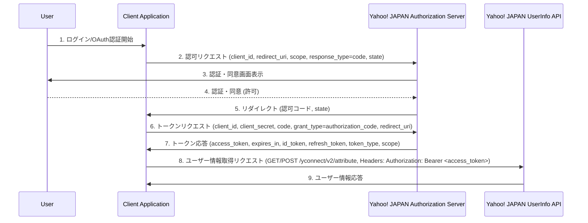

#  Yahoo! JAPAN ID連携とユーザー情報取得

## OAuth認証フロー

- **Yahoo! JAPAN ID連携は、OpenID ConnectおよびOAuth 2.0プロトコルに準拠しています。**


```mermaid
sequenceDiagram
    participant User
    participant ClientApp as Client Application
    participant YahooAuth as Yahoo! JAPAN Authorization Server
    participant YahooUserInfo as Yahoo! JAPAN UserInfo API

    User->>ClientApp: 1. ログイン/OAuth認証開始
    ClientApp->>YahooAuth: 2. 認可リクエスト (client_id, redirect_uri, scope, response_type=code, state)
    YahooAuth->>User: 3. 認証・同意画面表示
    User-->>YahooAuth: 4. 認証・同意 (許可)
    YahooAuth->>ClientApp: 5. リダイレクト (認可コード, state)
    ClientApp->>YahooAuth: 6. トークンリクエスト (client_id, client_secret, code, grant_type=authorization_code, redirect_uri)
    YahooAuth->>ClientApp: 7. トークン応答 (access_token, expires_in, id_token, refresh_token, token_type, scope)
    ClientApp->>YahooUserInfo: 8. ユーザー情報取得リクエスト (GET/POST /yconnect/v2/attribute, Headers: Authorization: Bearer <access_token>)
    YahooUserInfo->>ClientApp: 9. ユーザー情報応答
```

## エンドポイントと主なクエリパラメータ

- 認可エンドポイント
  - URL: https://auth.yahoo.co.jp/yconnect/v2/authorization
  - HTTPメソッド: GET
  - 主な必須クエリパラメータ:
    - client_id: アプリケーションのクライアントID。
    - redirect_uri: 認証後にユーザーがリダイレクトされるURL。
    - response_type: code を指定。
    - scope: 取得したいユーザー属性に対応するスコープをスペース区切りで指定。
    - state: CSRF攻撃を防ぐための任意の文字列。
- トークンエンドポイント
  - URL: https://auth.yahoo.co.jp/yconnect/v2/token
  - HTTPメソッド: POST
  - 主な必須リクエストボディパラメータ (application/x-www-form-urlencoded):
    - client_id: アプリケーションのクライアントID。
    - client_secret: アプリケーションのクライアントシークレット。
    - code: 認可エンドポイントから取得した認可コード。
    - grant_type: authorization_code (認可コードを交換する場合) または refresh_token (リフレッシュトークンで新しいアクセストークンを取得する場合)。
    - redirect_uri: 認可エンドポイントで使用したものと同じリダイレクトURI。

## レスポンス（正常時）

- トークンエンドポイントへのリクエストが成功すると、以下の情報を含むJSON形式のレスポンスが返されます。

```json
{
  "access_token": "A.B.C.D...",
  "expires_in": 3600,
  "id_token": "eyJ...",
  "refresh_token": "E.F.G.H...",
  "token_type": "Bearer",
  "scope": "openid profile email"
}
```

- access_token: Yahoo! JAPAN APIにアクセスするために使用するトークン。
- expires_in: アクセストークンの有効期間（秒）。通常1時間（3600秒）。
- id_token: ユーザーの認証情報と基本プロファイル情報を含むJWT。
- refresh_token: 新しいアクセストークンを取得するためのリフレッシュトークン。
- token_type: トークンの種類。
- scope: ユーザーが許可したスコープ。

## ユーザー情報取得APIエンドポイントと仕様概要

- **Yahoo! JAPAN ID連携では、UserInfo APIを通じてユーザーの属性情報を取得します。**
  - APIエンドポイント
    - API: UserInfo API
    - エンドポイント: https://userinfo.yahooapis.jp/yconnect/v2/attribute
    - HTTPメソッド: POST / GET
    - ヘッダー: Authorization: Bearer <access_token>

## 取得可能なユーザー情報フィールドと必要なスコープ

- 取得できる情報は、Authorizationエンドポイントで指定したscopeと、アプリケーションのID連携設定に依存します。

|パラメータ|	概要| 	必要なスコープ  |
|---|---|-----------|
|sub|	ユーザーの一意な識別子（GUIDまたはPPID）| 	openid   |
|name|	フルネーム| 	profile  |
|given_name|	名| 	profile  |
|family_name|	姓| 	profile  |
|given_name#ja-Kana-JP|	名（カナ）| 	profile  |
|family_name#ja-Kana-JP|	姓（カナ）| 	profile  |
|given_name#ja-Hani-JP|	名（漢字）| 	profile  |
|family_name#ja-Hani-JP|	姓（漢字）| 	profile  |
|gender|	性別 (male, female)	| profile   |
|birthdate|	出生年（YYYY形式）| 	profile  |
|nickname|	表示名| 	profile  |
|picture|	プロフィール画像URL| 	profile  |
|email|	メールアドレス| 	email    |
|email_verified|	メールアドレスの検証済みステータス| 	email    |
|address.country|	国コード（ISO 3166-1 alpha-2）| 	address  |
|address.postal_code|	郵便番号| 	address  |
|address.region|	都道府県| 	address  |
|address.locality|	市区町村| 	address  |
|address.formatted|	都道府県 + 市区町村の結合| 	address  |


## レスポンス例 (正常時)

```json
{
  "sub": "KVNE5DZLWIY4Y57TRDLURJOOEU",
  "name": "矢風太郎",
  "given_name": "太郎",
  "family_name": "矢風",
  "email": "yconnect@example.com",
  "email_verified": true,
  "gender": "male",
  "birthdate": "1986",
  "address": {
    "country": "JP",
    "postal_code": "1028282",
    "region": "東京都",
    "locality": "千代田区",
    "formatted": "東京都千代田区"
  }
}
```

## アクセストークンとリフレッシュトークン

- アクセストークン: 通常1時間（3600秒）有効です。APIリクエストの認証に使用されます。
- リフレッシュトークン: 公開鍵認証を利用している場合、4週間有効です。アクセストークンが期限切れになった際に、ユーザーの再認証なしに新しいアクセストークンを取得するために使用されます。

## エラーハンドリング

- API呼び出しでエラーが発生した場合、HTTPステータスコード 401 Unauthorized が返され、WWW-Authenticate ヘッダーまたはJSONPレスポンスボディにエラー情報が含まれます。
  - error: エラーコード (例: invalid_token, insufficient_scope)
  - error_description: エラーの詳細説明
- **特に多いエラー:**
  - invalid_token: アクセストークンが無効または期限切れ。
  - insufficient_scope: アクセストークンに、要求された情報取得に必要なスコープが含まれていない。または、アプリケーションのID連携設定でUserInfo APIの利用が許可されていない。

---

## [OAuth認証におけるエンドポイント、主なクエリパラメーター、およびレスポンスを確認できる公式ドキュメントへ ☞](https://developer.yahoo.co.jp/yconnect/)
