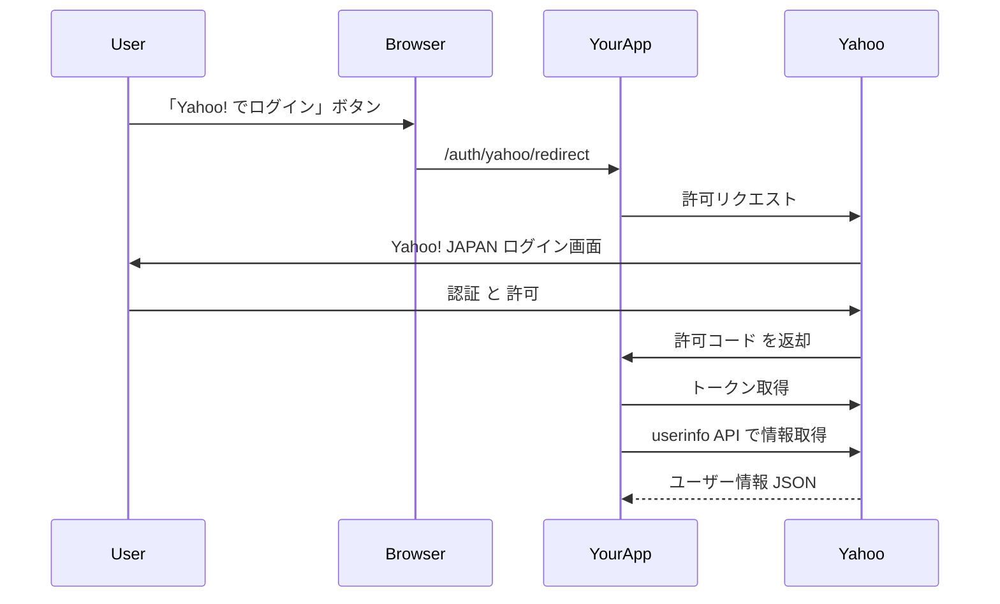

# Yahoo! JAPAN のプロフィール API 仕様

## 概要
- Yahoo! JAPAN の OAuth 2.0 認証では、OpenID Connect (OIDC)のスペックを使用することで、ユーザーのプロファイル情報を API 経由で取得できます。

---

- エンドポイント
```bash
GET https://userinfo.yahooapis.jp/yconnect/v2/attribute
```
- 主なクエリパラメーター（すべて必須）

| パラメーター          | 内容                                              |
| --------------- | ----------------------------------------------- |
| `Authorization` | `Bearer {access_token}`（ログインユーザーから取得したアクセストークン） |

- レスポンス（正常時）
```json
{
  "sub": "abcdefghijk1234567890",
  "name": "山田 太郎",
  "given_name": "太郎",
  "family_name": "山田",
  "email": "example@yahoo.co.jp",
  "email_verified": true,
  "nickname": "taro_y"
}
```

- フィールド一覧

| フィールド名           | 内容                            |
| ---------------- | ----------------------------- |
| `sub`            | Yahoo! JAPAN 側で一意のユーザー ID     |
| `name`           | フルネーム                         |
| `given_name`     | 名                             |
| `family_name`    | 姓                             |
| `email`          | メールアドレス                       |
| `email_verified` | メールが認証済みかどうか (`true`/`false`) |
| `nickname`       | ニックネーム                        |

#### 「エンドポイント」「クエリ／パラメーター」「レスポンス」「フィールド仕様」が確認できる公式ドキュメントまとめ

- [ユーザー情報取得 API (/yconnect/v2/attribute)](https://developer.yahoo.co.jp/yconnect/v2/authorization_code/authorization.html)

- [トークン取得 API (/yconnect/v2/token)]()

- [OIDC Discovery（.well-known 情報）]()

---
## 認証フローの概要

```mermaid
sequenceDiagram
    participant User
    participant Browser
    participant YourApp
    participant Yahoo

    User->>Browser: 「Yahoo! でログイン」ボタン
    Browser->>YourApp: /auth/yahoo/redirect
    YourApp->>Yahoo: 許可リクエスト
    Yahoo->>User: Yahoo! JAPAN ログイン画面
    User->>Yahoo: 認証 と 許可
    Yahoo->>YourApp: 許可コード を返却
    YourApp->>Yahoo: トークン取得
    YourApp->>Yahoo: userinfo API で情報取得
    Yahoo-->>YourApp: ユーザー情報 JSON
```


## ユーザー情報 API (userinfo)

- エンドポイント:
```text
GET https://userinfo.yahooapis.jp/yconnect/v2/attribute
```
- ヘッダに Bearer Token を追加:
```text
- Authorization: Bearer {access_token}
```
- 必要スコープ:
```text
openid email profile
```

## レスポンス例 (JSON)

```text
{
  "sub": "abcdefghijk1234567890",
  "name": "界塚 伊奈帆",
  "given_name": "伊奈帆",
  "family_name": "界塚",
  "email": "example@yahoo.co.jp",
  "email_verified": true,
  "nickname": "taro_y"
}
```
- sub: Yahoo! JAPAN 側で一意のユーザーID
- name, given_name, family_name: 名前情報
- email: 登録メールアドレス
- nickname: ニックネーム

## ID Token に含まれる情報
- Yahoo! JAPAN は OIDC 対応のため、/token で取得した ID Token (JWT) にも情報が含まれます:
```text
{
  "sub": "abcdefghijk1234567890",
  "aud": "your-client-id",
  "email": "example@yahoo.co.jp",
  "email_verified": true,
  "exp": 1712345678,
  "iat": 1712340000
}
```
- sub は userinfo API と同じ値
- email は取得可能だが、認証手順により null の場合も


## 注意点
- Yahooログイン情報は、アプリ側のプライバシーポリシーによって制限される場合あり
- openid email profile のスコープは絶対に含めること
- Yahoo! JAPAN は、Socialite本体には本来未搭載なので socialiteproviders/yahoo-japan 拡張を使用

## まとめ
- Yahoo! JAPAN のユーザー情報APIは OIDC準拠
- /userinfo API で email, name, nickname などが取得可能
- ID Token (JWT) にも一部情報が含まれる
- Laravel Socialite での実装例は [yahoo.py](../auth-flow-examples/yahoo.py) を参照

