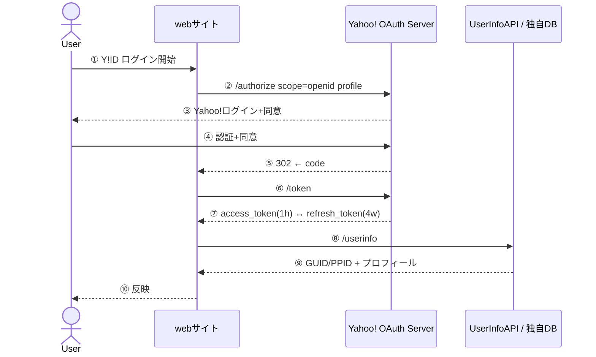

### [ ⏎ 戻る](../index.md)
#  Yahoo! JAPAN ID連携とユーザー情報取得

## OAuth認証フロー

- **Yahoo! JAPAN ID連携は、OpenID ConnectおよびOAuth 2.0プロトコルに準拠しています。**


```mermaid
sequenceDiagram
  actor User
  participant Site as webサイト
  participant YAuth as Yahoo! OAuth Server
  participant YAPI as UserInfoAPI / 独自DB

  User->>Site: ① Y!ID ログイン開始
  Site->>YAuth: ② /authorize scope=openid profile
  YAuth-->>User: ③ Yahoo!ログイン+同意
  User->>YAuth: ④ 認証+同意
  YAuth-->>Site: ⑤ 302 ← code
  Site->>YAuth: ⑥ /token
  YAuth-->>Site: ⑦ access_token(1h) ↔ refresh_token(4w)
  Site->>YAPI: ⑧ /userinfo
  YAPI-->>Site: ⑨ GUID/PPID + プロフィール
  Site-->>User: ⑩ 反映

```

---
### ログインしているユーザーIDを安全に取得するための、最も推奨される、そして最終的に最も確実なステップ

#### [ユーザーID取得方法へ](../allowed-code-flows/yahoo_japan_user_id.md)


---

## webサイトからサーバーに向けて打つAPIの回数

- 回数：3 回

## それぞれのAPIのエンドポイントと正常時のレスポンス

---
## GET https://auth.login.yahoo.co.jp/yconnect/v2/authorization
### 用途：
- ユーザーを Yahoo! JAPAN のログイン＋同意画面に誘導
- 認可コード（code）を取得するための第一段階


### 必要なパラメータ（URLクエリ）

| 要素                   | 説明                                         |
| -------------------- | ------------------------------------------ |
| `client_id`          | Yahoo! デベロッパーネットワークで発行されたアプリ識別子            |
| `redirect_uri`       | 認可後に `code` を返す自社サイトのコールバック URL（事前登録必須）    |
| `response_type=code` | 認可コードフローを指定する固定値                           |
| `scope`              | 取得を許可する情報範囲（例：`openid profile email`）      |
| `state`              | CSRF 攻撃防止のランダム文字列                          |
| `nonce`              | `id_token` 検証用のランダム文字列（OpenID Connect 利用時） |
| `prompt` (任意)        | `"login"` など再認証や同意画面表示の強制オプション（任意設定）       |

### 認可エンドポイントからの リダイレクト／POST レスポンス(/yconnect/v2/authorization)
- ステータス：302 Found
- Location ヘッダー：
```text
https://your.site/callback?
  code=AUTH_CODE&
  state=ORIGINAL_STATE
```
- 方式：自動 GET リダイレクト
- 返却パラメータ：
  - code：認可コード
  - state：CSRF 対策トークン

- エラー時：
```text
?error=access_denied&
  error_description=User+denied+
  the+authorization&
  state=...
```
- 注):
- nonce を使う場合、ID トークンの照合にも用いる
- scope に応じて /userinfo で取得できる属性が変化する


---
## POST https://auth.login.yahoo.co.jp/yconnect/v2/token
### 用途：
- 認可コード（code）を アクセストークン／リフレッシュトークン／IDトークン に交換

### 必要なパラメータ（POST body: application/x-www-form-urlencoded）

| 要素                              | 説明                        |
| ------------------------------- | ------------------------- |
| `grant_type=authorization_code` | 認可コードフローを指定               |
| `code`                          | 上段で得た認可コード                |
| `client_id`                     | 認可リクエストと同一のクライアントID       |
| `client_secret`                 | Yahoo!から発行されたクライアントシークレット |
| `redirect_uri`                  | 認可リクエスト時と完全一致させる必要がある URL |
| `code_verifier` (任意)            | PKCE を利用する場合の元文字列         |


### レスポンス（JSON）:
```json
{
  "access_token": "ACCESS_TOKEN",   // API呼び出し用トークン
  "token_type": "Bearer",           // 通常は "Bearer"
  "expires_in": 3600,               // access_token の有効期間（秒）
  "refresh_token": "REFRESH_TOKEN", // 新しい access_token を取得するためのトークン
  "id_token": "ID_TOKEN_JWT",       // JWT形式のユーザー認証情報（OpenID Connect）
  "scope": "openid profile email"   // 実際に付与されたスコープ
}
```
| 要素              | 説明                                              |
| --------------- | ----------------------------------------------- |
| `access_token`  | リソースAPI呼び出し時に `Authorization: Bearer` で送付するトークン |
| `expires_in`    | `access_token` の残り有効期間（秒）                       |
| `refresh_token` | 再認証不要で新しい access\_token を得るための長命トークン            |
| `id_token`      | ユーザーIDやメールなどを含む JWT（自己署名されたトークン）                |
| `scope`         | クライアントに実際に許可されたスコープ                             |


---
## GET https://userinfo.yahooapis.jp/yconnect/v2/attribute

### 用途：
- access_token を用いてユーザー属性情報を取得

### 必要な要素（HTTPヘッダー）:
```text
Authorization: Bearer ACCESS_TOKEN
```

### レスポンス（JSON）:
```json
{
  "sub": "xxxxxxxxxxxxxxxxxxxx",   // Yahoo! が発行する一意ユーザーID（GUID/PPID）
  "name": "山田 太郎",             // 氏名
  "given_name": "太郎",            // 名
  "family_name": "山田",           // 姓
  "email": "taro@example.jp",     // メールアドレス
  "email_verified": true,          // メール検証済みフラグ
  "gender": "male",                // 性別
  "birthdate": "1985",             // 生年
  "locale": "ja-JP",               // ロケール
  "zoneinfo": "Asia/Tokyo",        // タイムゾーン
  "picture": "https://…/photo.jpg" // プロフィール画像URL
}
```
| 要素                                    | 説明                             |
| ------------------------------------- | ------------------------------ |
| `sub`                                 | アプリケーションごとに一意なユーザー識別子          |
| `name` / `given_name` / `family_name` | ユーザーの氏名、名、姓                    |
| `email`                               | ユーザーのメールアドレス（認可範囲内で返却）         |
| `email_verified`                      | 上記メールが検証済みかどうか（`true`/`false`） |
| `gender`                              | 性別（`male`/`female` 等）          |
| `birthdate`                           | 生年（YYYY）                       |
| `locale`                              | ロケール文字列（例：`ja-JP`）             |
| `zoneinfo`                            | タイムゾーン識別子（例：`Asia/Tokyo`）      |
| `picture`                             | プロフィール画像の URL                  |

### [ ⏎ 戻る](../index.md)
