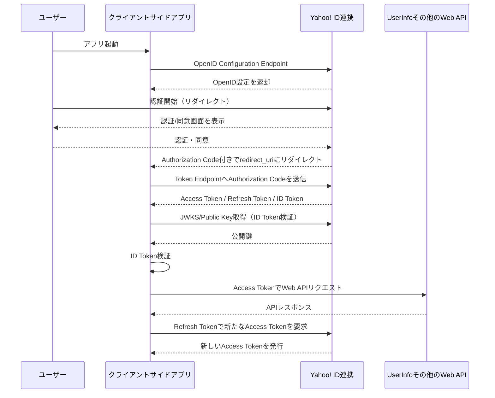
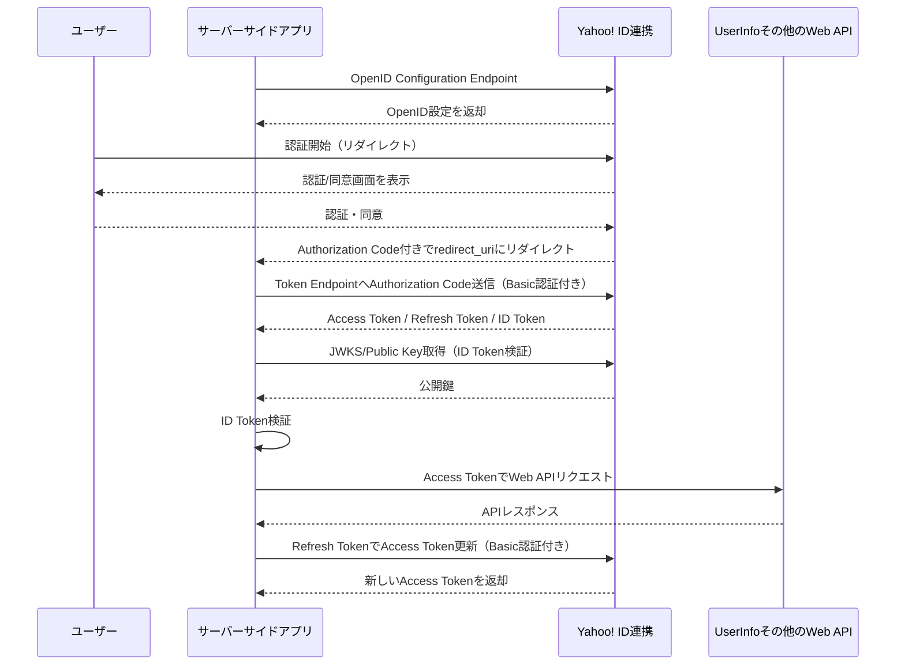

# Yahoo! JAPAN のプロフィール API 仕様

## 概要
- Yahoo! JAPAN の OAuth 2.0 認証では、OpenID Connect (OIDC)のスペックを使用することで、ユーザーのプロファイル情報を API 経由で取得できます。

---

- エンドポイント
```bash
GET https://auth.login.yahoo.co.jp/yconnect/v2/authorization
```
- 主なクエリパラメーター（すべて必須ではないが重要）

| パラメーター名                 | 必須 | 説明                                                        |
| ----------------------- | -- | --------------------------------------------------------- |
| `response_type`         | ○  | `"code"` を指定（認可コードグラント用）                                  |
| `client_id`             | ○  | アプリケーションの Client ID                                       |
| `redirect_uri`          | ○  | 事前登録済みのリダイレクトURIと**完全一致**している必要あり                         |
| `scope`                 | ○  | アクセス要求する情報（例：`openid profile email`）                      |
| `state`                 | △  | CSRF対策。ランダムな文字列を発行して検証必須                                  |
| `nonce`                 | △  | リプレイアタック対策。ID Token に含まれて返る                               |
| `display`               | ×  | 表示形式（`page`, `touch`, `popup`, `inapp`）                   |
| `prompt`                | ×  | `consent`, `login`, `select_account`, `none` などのアクション強制設定 |
| `max_age`               | ×  | 最大認証経過時間（秒単位）。例：3600                                      |
| `code_challenge`        | △  | PKCE用：`code_verifier` から導出したチャレンジコード                      |
| `code_challenge_method` | △  | `S256` または `plain`（推奨は `S256`）                            |
| `bail`                  | ×  | `bail=1` で同意拒否時のリダイレクト先を明示                                |


- レスポンス（正常時）
```http
HTTP/1.1 302 Found
Location: https://example.org/cb?code=SxlOBeZQ&state=af0ifjsldkj
```

- フィールド一覧

| フィールド名  | 必須 | 説明                                 |
| ------- | -- | ---------------------------------- |
| `code`  | ○  | 認可コード（ユーザーが同意した場合のみ付与）             |
| `state` | △  | リクエスト時に送信した `state` 値（CSRF対策のため照合） |


#### 「エンドポイント」「クエリ／パラメーター」「レスポンス」「フィールド仕様」が確認できる公式ドキュメントまとめ

- [ユーザー情報取得 API (/yconnect/v2/attribute)](https://developer.yahoo.co.jp/yconnect/v2/authorization_code/authorization.html)

- [トークン取得 フロー (/yconnect/v2/token)](https://developer.yahoo.co.jp/yconnect/v2/authorization_code/)

---
## 認証フローの概要

## クライアントサイドアプリ用（Client-side Flow）

```mermaid
sequenceDiagram
    participant User as ユーザー
    participant ClientApp as クライアントサイドアプリ
    participant Yahoo as Yahoo! ID連携
    participant API as UserInfoその他のWeb API

    User->>ClientApp: アプリ起動
    ClientApp->>Yahoo: OpenID Configuration Endpoint
    Yahoo-->>ClientApp: OpenID設定を返却

    User->>Yahoo: 認証開始（リダイレクト）
    Yahoo-->>User: 認証/同意画面を表示
    User-->>Yahoo: 認証・同意
    Yahoo-->>ClientApp: Authorization Code付きでredirect_uriにリダイレクト

    ClientApp->>Yahoo: Token EndpointへAuthorization Codeを送信
    Yahoo-->>ClientApp: Access Token / Refresh Token / ID Token

    ClientApp->>Yahoo: JWKS/Public Key取得（ID Token検証）
    Yahoo-->>ClientApp: 公開鍵
    ClientApp->>ClientApp: ID Token検証

    ClientApp->>API: Access TokenでWeb APIリクエスト
    API-->>ClientApp: APIレスポンス

    ClientApp->>Yahoo: Refresh Tokenで新たなAccess Tokenを要求
    Yahoo-->>ClientApp: 新しいAccess Tokenを発行

```
## サーバーサイドアプリ用（Server-side Flow）

```mermaid
sequenceDiagram
  participant User as ユーザー
  participant ServerApp as サーバーサイドアプリ
  participant Yahoo as Yahoo! ID連携
  participant API as UserInfoその他のWeb API

  ServerApp->>Yahoo: OpenID Configuration Endpoint
  Yahoo-->>ServerApp: OpenID設定を返却

  User->>Yahoo: 認証開始（リダイレクト）
  Yahoo-->>User: 認証/同意画面を表示
  User-->>Yahoo: 認証・同意
  Yahoo-->>ServerApp: Authorization Code付きでredirect_uriにリダイレクト

  ServerApp->>Yahoo: Token EndpointへAuthorization Code送信（Basic認証付き）
  Yahoo-->>ServerApp: Access Token / Refresh Token / ID Token

  ServerApp->>Yahoo: JWKS/Public Key取得（ID Token検証）
  Yahoo-->>ServerApp: 公開鍵
  ServerApp->>ServerApp: ID Token検証

  ServerApp->>API: Access TokenでWeb APIリクエスト
  API-->>ServerApp: APIレスポンス

  ServerApp->>Yahoo: Refresh TokenでAccess Token更新（Basic認証付き）
  Yahoo-->>ServerApp: 新しいAccess Tokenを返却

```


## ユーザー情報 API (userinfo)

- エンドポイント:
```text
GET https://userinfo.yahooapis.jp/yconnect/v2/attribute
```
- ヘッダに Bearer Token を追加:
```text
- Authorization: Bearer {access_token}
```
- 必要スコープ:
```text
openid email profile
```

## レスポンス例 (JSON)

```text
{
  "sub": "abcdefghijk1234567890",
  "name": "界塚 伊奈帆",
  "given_name": "伊奈帆",
  "family_name": "界塚",
  "email": "example@yahoo.co.jp",
  "email_verified": true,
  "nickname": "taro_y"
}
```
- sub: Yahoo! JAPAN 側で一意のユーザーID
- name, given_name, family_name: 名前情報
- email: 登録メールアドレス
- nickname: ニックネーム

## ID Token に含まれる情報
- Yahoo! JAPAN は OIDC 対応のため、/token で取得した ID Token (JWT) にも情報が含まれます:
```text
{
  "sub": "abcdefghijk1234567890",
  "aud": "your-client-id",
  "email": "example@yahoo.co.jp",
  "email_verified": true,
  "exp": 1712345678,
  "iat": 1712340000
}
```
- sub は userinfo API と同じ値
- email は取得可能だが、認証手順により null の場合も


## 注意点
- Yahooログイン情報は、アプリ側のプライバシーポリシーによって制限される場合あり
- openid email profile のスコープは絶対に含めること
- Yahoo! JAPAN は、Socialite本体には本来未搭載なので socialiteproviders/yahoo-japan 拡張を使用

## まとめ
- Yahoo! JAPAN のユーザー情報APIは OIDC準拠
- /userinfo API で email, name, nickname などが取得可能
- ID Token (JWT) にも一部情報が含まれる
- Laravel Socialite での実装例は [yahoo.py](../auth-flow-examples/yahoo.py) を参照

