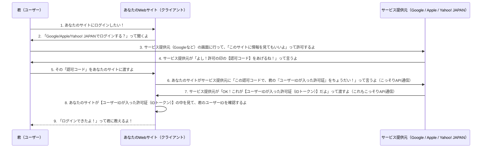

# OpenID Connect (OIDC)

- OpenID Connect (OIDC) は、OAuth 2.0プロトコルの上に構築された、シンプルで相互運用可能な認証レイヤーです。
- ユーザーの身元を検証し、その基本的なプロフィール情報を、認可サーバー（Identity Provider: IdP）からクライアントアプリケーションへ提供することを主な目的としています。

- **OAuth 2.0 との明確な関係性**
>OpenID Connectを理解する上で最も重要な点は、それがOAuth 2.0とどのように異なるか、そしてどのように連携するかを把握することです。

---

- **OAuth 2.0:**

```text
これは「認可 (Authorization)」のためのフレームワークです。
ユーザーが自身の情報へのアクセス権限を、別のサービスに安全に委譲するための仕組みを提供します。
OAuth 2.0自体はユーザーの身元を認証する機能を持たず、「誰が」リソースへのアクセスを許可したかではなく、
「アクセスが許可された」という事実のみを扱います。
```

- **OpenID Connect (OIDC):**
```text
これはOAuth 2.0の認可機能を活用し、その上に「認証 (Authentication)」のレイヤーを追加します。
OIDCは、OAuth 2.0の既存のフロー（特に認可コードフロー）を利用して、ユーザーの認証を行い、
その結果として、クライアントアプリケーションがユーザーの身元を安全に検証できるIDトークンを発行します。
```

>簡潔に言えば、OAuth 2.0が「アクセス許可」を与える仕組みであるのに対し、OIDCは「誰がログインしたか（身元認証）」を証明する仕組みであり、
> OAuth 2.0を基盤としてその機能を実現しています。

---
 
### OIDC の主要な要素と動作原理

- OIDCの認証フローは、OAuth 2.0の認可コードフローを拡張した形で進行します。

1. 認可リクエスト (Authentication Request):

```text
クライアントアプリケーションは、ユーザーのブラウザを認可サーバー（IdP）の認可エンドポイントへリダイレクトします。
この際、

response_type=code（認可コードフローの指定）、
scope=openid（OIDC認証の要求を示す必須スコープ）、
client_id、redirect_uri、
state、
そしてセキュリティ強化のためのcode_challengeとcode_challenge_method（PKCE）、

などのパラメータを含めます。
```

2. ユーザー認証と同意:

```text
ユーザーは認可サーバー上で自身の資格情報（ID/パスワードなど）を用いて認証を行い、
クライアントアプリケーションが要求する情報（プロファイル、メールアドレスなど）へのアクセスを許可します。
```

3. 認可コードの受け渡し:

```text
認証と同意が完了すると、認可サーバーはユーザーのブラウザをクライアントアプリケーションの事前登録されたredirect_uriへリダイレクトし、
URLのクエリパラメータとして認可コード (code) とstateを返します。
```

4. トークン交換 (Token Exchange):

```text
クライアントアプリケーションのバックエンドサーバーは、
受け取った認可コードと

client_id、client_secret（機密クライアントの場合）、
redirect_uri、code_verifier（PKCEの場合）、

を用いて、認可サーバーのトークンエンドポイントへ直接（サーバー間通信で）POSTリクエストを送信します。
```

5. トークンの発行とIDトークンの検証:

```text
トークン交換が成功すると、
認可サーバーはアクセストークン（リソースへのアクセス許可証）と共に、

OIDCの核心であるIDトークン、
およびリフレッシュトークン（アクセストークンの更新用）

をJSON形式で返します。
```
- **IDトークン:** これはJWT (JSON Web Token) 形式であり、デコードするとユーザーの身元情報（クレーム）が含まれています。最も重要なクレームはsub (Subject Identifier) であり、これが認可サーバーにおけるユーザーの一意な識別子となります。
- クライアントアプリケーションは、受け取ったIDトークンの署名を検証し、iss (発行者)、aud (対象者：自身のclient_id)、exp (有効期限) などのクレームを厳密にチェックすることで、トークンの正当性、改ざんされていないこと、そして対象のユーザー向けであることを確認します。

---

### OIDC を採用する主要なメリット

- **セキュリティの強化:**
  - JWTの署名検証、PKCEの利用、stateやnonceの検証メカニズムにより、リプレイ攻撃やCSRF攻撃などに対する堅牢な保護を提供します。IDトークンの暗号化も可能です。

- **標準化と相互運用性:**
  - 標準化された認証フローとデータ形式（JWT）により、異なるIdP（Google, Apple, Microsoft Azure ADなど）との連携が容易になり、開発コストを削減します。

- **開発の簡素化:**
  - 認証に関する複雑なロジックをIdPに委ねることができ、クライアントアプリケーション側での認証実装の負担が軽減されます。豊富なOIDCクライアントライブラリやSDKが利用可能です。

- **ユーザー体験の向上 (SSO):**
  - ユーザーが一度IdPにログインすれば、複数のOIDC対応アプリケーションで再認証なしにログインできる、シームレスなシングルサインオン (SSO) を実現し、ユーザーの利便性を高めます。

- **基本的なプロフィール情報の取得:**
  - subクレームによるユーザー識別子だけでなく、profileやemailなどのスコープを要求することで、ユーザーの氏名、メールアドレスといった基本的なプロフィール情報を安全に取得し、アプリケーションのパーソナライゼーションに活用できます。

---

### ユーザーID取得まで

